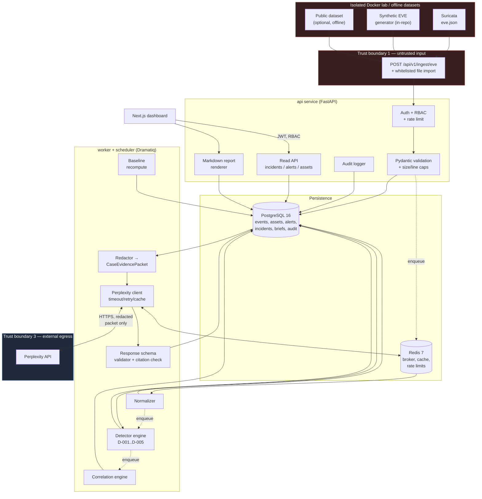

# AegisNet — System Architecture

Status: **Target design; §0 says what of it is on `main` at `v1.0.0`.** The rest is the design the six
milestones were built towards, which is why parts of it still read as a plan. Where the plan and the code
differ, §0 is the row that was checked against the code, and `docs/STATUS.md` carries the evidence.
Last updated: 2026-09-06 (Chunk 31, reconciled against the code at the release gate)

---

## 0. Implementation status at `v1.0.0`

| Part of this document | State on `main` (evidence in `docs/STATUS.md`) |
|---|---|
| §1 layering and `domain/` purity | Implemented and enforced by import-linter in CI (two contracts) |
| §2 `api`, `worker`, `db`, `broker/cache`, `web` | Running: FastAPI api with auth, RBAC, audit and rate limits; Dramatiq worker with seven actors (`import_dataset`, `import_upload`, `run_detectors`, `recompute_baselines`, and the three periodic ones — `scheduled_sweep`, `nightly_baselines`, `nightly_retention`); PostgreSQL 16 with three roles (app, migrator, and the retention role, which holds the only `DELETE` on the four retained tables — the app role's one `DELETE` grant is on `asset_networks`, which `PATCH /assets/{id}` replaces wholesale); Redis 7 as broker, limiter and denylist; the Next.js 16 analyst dashboard |
| §2 `scheduler` (periodiq) | Deferred by ADR-010; **delivered in M2 Chunk 12 (ADR-020)**: a sixth service sending the ten-minute sweep and the nightly baseline recompute, and since Chunk 25 the nightly retention prune (ADR-033) |
| §2 `perplexity` client | Implemented in M5 (Chunks 21–24, ADR-029 – ADR-032): the redaction boundary, the hardened client, the brief schema and its citation and safety checks, two append-only tables and the dashboard panel. **Off by default, and no outbound call has ever been made from this repository** |
| §3 ingest → validate → persist → enqueue | Implemented: HTTP and registry import, capped spool, per-line rejects, idempotent `event_hash`, audit per batch |
| §3 detectors, baselines, correlation, redaction, briefs, export | All implemented: detectors, baselines and alert storage (M2, Chunks 8 – 12); correlation and the incident workflow (M3, Chunks 15 – 17, ADR-023 – ADR-025); the redaction boundary and briefs (M5, Chunks 21 – 23, ADR-029 – ADR-031); the deterministic `report.md` export (Chunk 24, ADR-032). Two of them run somewhere other than §2's table says: correlation is an operator command (`make correlate`, and `make demo-scenario`), not an actor, and a brief is generated in the request path rather than by the worker |
| §4 trust boundaries | Mitigations in place with named tests for every boundary. TB-3 and TB-4 arrived with M5 and are no exception: §6's matrix is thirty-six rows, every one of them a `test` row (`THREAT_MODEL.md`) |
| §6 topology | Six services, loopback only, samples mounted read-only, `ingest_spool` volume shared by api and worker; plus the opt-in lab on its own `internal: true` network (M2 Chunk 13, ADR-021), which the application stack never starts |
| §7 failure modes | Redis down: login, ingest and a brief request fail closed (`429`), reads proceed; malformed lines become rejects; a detector exception is isolated per rule and recorded in `detector_runs`. The two Perplexity rows are implemented and asserted against an `httpx.MockTransport` only — **no outbound call has ever been made from this repository**, so how the real API fails is unobserved |

## 1. Architectural style

A **modular monolith** backend with an out-of-process worker tier, plus a separate frontend app.

Why not microservices: the domain is small, the transactions are cross-cutting (ingest → normalize → detect →
correlate), and a reviewer must be able to run everything with one command. Why not a single process: detection
sweeps, baseline recomputation, and Perplexity API calls are long-running and must not block the request path.

Backend layering is strict and enforced by import rules in CI:

```
api/ (FastAPI routers, auth, DTOs)
  ↓ depends on
services/ (use-cases: ingest, detect, correlate, brief, export)
  ↓ depends on
domain/ (pure logic: detectors, correlation, severity, redaction — NO I/O, NO ORM imports)
  ↑ used by
adapters/ (SQLAlchemy repos, Redis, Perplexity client, filesystem)
```

`domain/` has zero infrastructure imports. That is what makes the five detectors and the redactor unit-testable
against fixtures with no database.

## 2. Components

| Component | Tech | Responsibility |
|---|---|---|
| `web` | Next.js 16 (App Router), TypeScript; no CSS framework — M4 shipped on one stylesheet and declined the planned Tailwind | Analyst dashboard (M4); a health placeholder in M1 |
| `api` | Python 3.12, FastAPI, Pydantic v2, SQLAlchemy 2.0 (async), Alembic | REST API, auth/RBAC, validation, rate limiting, audit logging, enqueue jobs |
| `worker` | Dramatiq | Normalization, detector sweeps, correlation, baseline recompute, Perplexity brief generation |
| `scheduler` | periodiq (Dramatiq companion) | Periodic detector sweep (every 10 min, 60 min lookback) + nightly baseline recompute + nightly retention prune (Chunk 25, ADR-033) — **in the stack since M2 Chunk 12 (ADR-020)**; a completed ingest batch also queues its own sweep |
| `db` | PostgreSQL 16 | System of record; JSONB for event payloads and evidence |
| `broker/cache` | Redis 7 | Dramatiq broker, rate-limit counters, the daily brief budget, the access-token denylist. The Perplexity response cache is **not** here — it is per-process inside the client, which is exactly why the budget had to move to Redis (three processes held three counters) |
| `perplexity` | External HTTPS | Sole external egress, via a single hardened client module |

### Background-work decision: **Dramatiq** (with periodiq)

Chosen over Celery and RQ. Justification:

1. **Per-actor reliability primitives are first-class.** `max_retries`, exponential backoff with jitter, and
   `time_limit` are declared on the actor itself. The Perplexity integration and detector sweeps both need
   exactly this, and Celery requires more configuration ceremony to get equivalent behaviour safely.
2. **Deterministic testing.** Dramatiq ships `StubBroker` + `Worker`, so integration tests can enqueue a job,
   `join()` the queue, and assert on database state inside pytest with no live Redis and no `eager` mode
   caveats. This directly serves the requirement that detectors and correlation have real integration tests.
3. **Smaller surface, less foot-gun.** Celery's configuration space (result backends, prefetch, ack semantics,
   protocol versions) is the largest source of "works locally, breaks in CI" issues in a portfolio project.
   AegisNet needs a job queue, not a distributed task framework.
4. **RQ rejected** because its retry/scheduling story is thinner and its worker model is fork-per-job, which is
   a poor fit for repeated detector sweeps that benefit from a warm process.

Trade-off accepted: a smaller ecosystem and fewer StackOverflow answers than Celery. Mitigation: the job layer
is thin and confined to `adapters/queue/`, so swapping brokers later is a contained change.

## 3. Data flow



## 4. Trust boundaries (summary; full analysis in `THREAT_MODEL.md`)

| # | Boundary | Crossing data | Primary control |
|---|---|---|---|
| TB-1 | Lab/dataset → API ingest | Attacker-influenced log text | Pydantic validation, size caps, no eval/format of log content, JSONB storage never rendered as HTML |
| TB-2 | Browser → API | Analyst actions | JWT auth, RBAC, CSRF-safe token handling, server-side state-machine validation |
| TB-3 | AegisNet → Perplexity | `CaseEvidencePacket` only | Allow-list serializer, redaction test suite, size cap, no raw log text |
| TB-4 | Perplexity → AegisNet | LLM-generated text + citations | `InvestigationBrief` schema validation, citation resolution check, render as untrusted text (no HTML injection, links `rel="noopener noreferrer nofollow"`) |
| TB-5 | API → worker | Job payloads | Ids only, never blobs; worker re-reads from DB |

## 5. Key design decisions (ADR summaries)

**ADR-001 — Store both raw-ish payload and promoted columns.** Events keep a validated JSONB `payload` plus
typed columns for the fields detectors actually query (`src_ip`, `dest_ip`, `dest_port`, `proto`, `event_type`,
`bytes_toserver`, `bytes_toclient`, `dns_query`). Rationale: detectors stay fast and indexable while nothing
useful from EVE is lost. Cost: some duplication; accepted.

**ADR-002 — Detectors are pure functions over a window.** Signature `detect(window: EventWindow, params: RuleParams) -> list[DetectionResult]`.
Rationale: labelled positive/negative fixtures become trivial, and evaluation metrics are honest.

**ADR-003 — Two kinds of "alert".** Suricata's own signature hits are *evidence* (`events.payload.alert`),
while AegisNet detector output is an `alerts` row. Conflating them would make the evaluation meaningless.

**ADR-004 — Correlation is entity+time windowed, not graph-based.** Deterministic, explainable, cheap. Graph
correlation is a v2 idea.

**ADR-005 — Idempotent ingest by `event_hash`.** `sha256` over a canonical subset of EVE fields. Re-running the
demo does not duplicate data — critical for reproducibility.

**ADR-006 — Perplexity responses are cached by packet hash.** Deterministic demos, lower cost, and a reviewer
without an API key still sees a brief from a committed fixture in demo mode.

**ADR-007 — Frontend never talks to the database.** All access via the API, so RBAC and audit logging cannot be
bypassed.

## 6. Deployment topology (Docker Compose)

Services in Milestone 1: `db`, `redis`, `api`, `worker`, `web`; `scheduler` joined in Milestone 2 (ADR-010, ADR-020). The
isolated Suricata lab (ADR-021) is a separate compose file on a separate `internal: true` network and is never part of
this stack. All on one
internal bridge network; only `web` (3000) and `api` (8000) publish ports. `api` and `worker` mount `./samples`
read-only and share the `ingest_spool` named volume where uploads wait between the request and the actor (ADR-016). No service is exposed on a routable interface by default, and the compose
file binds published ports to `127.0.0.1`. Healthchecks gate `api` on `db` + `redis`, and `web` on `api`.
Secrets come from `.env` (never committed); `.env.example` is the documented template.

The Suricata lab lives in a **separate**, explicitly opt-in compose file (`infra/lab/docker-compose.lab.yml`) on
an internal-only network with no default route, so lab traffic generation can never leave the host.

## 7. Failure modes and degradation

| Failure | Behaviour |
|---|---|
| Redis down | Login and ingest answer `429` (limits fail closed, ADR-016); reads and the default group proceed and log an error; a queued import waits for the broker to return |
| Perplexity unreachable / 429 / 5xx | Retry with backoff, then mark brief `failed`; incident fully usable; error surfaced non-blockingly in UI |
| Perplexity returns unparseable output | Brief rejected and stored with `failure_reason` `malformed_json` or `schema_rejected`, recorded, no partial brief shown |
| Malformed EVE lines | Per-line reject into `ingest_rejects`; batch still succeeds; counts reported |
| Detector exception | Isolated per rule per window; recorded in `detector_runs` with error; other detectors continue |

## 8. Future extension: Zeek

The normalizer is an interface (`SourceNormalizer.normalize(line: str) -> NormalizedEvent | Reject`). Adding
Zeek JSON means one new implementation plus a `source_type` on `ingest_batch`. No schema change to `events` is
anticipated beyond an enum value. Deliberately out of v1 scope.
