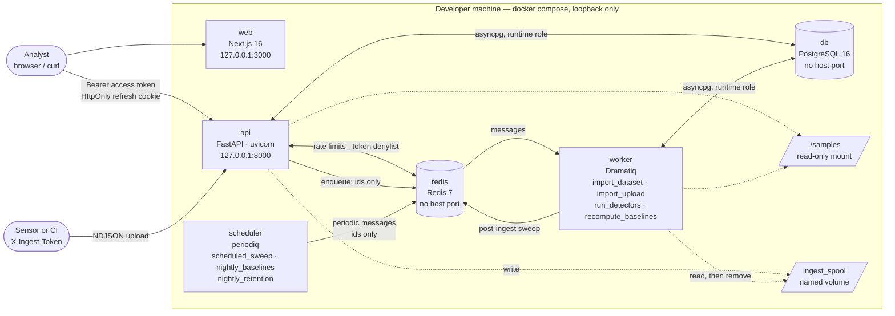
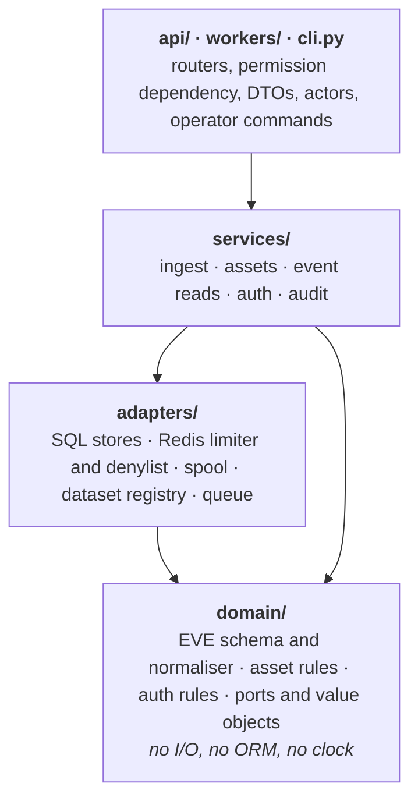
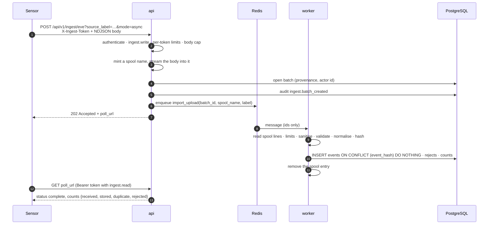
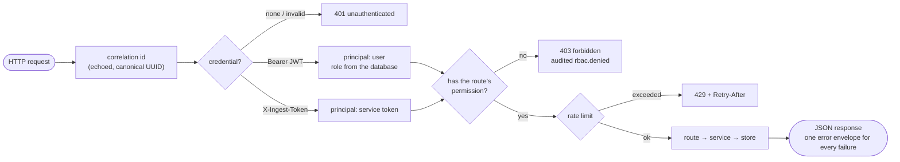

# AegisNet — Network Threat Detection Lab

[](https://github.com/pchrysostomou/aegisnet/actions/workflows/ci.yml)
[](https://github.com/pchrysostomou/aegisnet/actions/workflows/security.yml)
[](backend/pyproject.toml)
[](LICENSE)

A self-hosted, **defensive-only** platform for ingesting network security telemetry
(Suricata EVE JSON), detecting suspicious behaviour with deterministic heuristics,
correlating findings into incidents, and producing evidence-based investigation briefs for
human analysts. Everything runs on one machine with `docker compose`, binds to loopback,
and can be exercised end to end with the committed synthetic corpus.

> **Status: all six milestones complete; `v1.0.0` released (Chunks 1–31).** The stack
> builds and reaches healthy from a clean clone; the schema is created with least-privilege
> grants; users, roles, service tokens, rate limits and an append-only audit trail are in
> place; the HTTP API ingests telemetry, manages the asset inventory and serves bounded event
> reads. **All five detection rules run over stored events:** a `periodiq` scheduler sweeps
> every ten minutes and recomputes baselines nightly, every completed ingest batch queues its
> own sweep, alerts are stored under a dedup key and served by the API, and `make eval` writes
> the first per-detector metrics table from the labelled cases and the benign corpus. Those
> numbers come from synthetic data authored here. The isolated Suricata lab now exists too: an
> opt-in, internal-only network where a pinned Suricata watches traffic between two containers
> this project creates. It found two real defects on its first run, both since fixed
> ([ADR-022](docs/adr/ADR-022-event-time-and-dns-direction.md)), and **four of the five rules
> now fire on a committed capture of real sensor output**; the fifth abstains for want of a
> baseline. What that is and is not evidence of is written down in
> [`docs/evaluation.md`](docs/evaluation.md) §9. Correlation, the analyst dashboard and the
> brief boundary now exist; **the brief feature is off by default and no call has ever been
> made from this repository** — every test runs against committed fixtures, and turning it on
> takes a key and a deliberate setting. [`docs/STATUS.md`](docs/STATUS.md) is the authoritative
> record of what exists and what has been verified, with the evidence for every claim below.

---

## Contents

- [Safety and scope boundary](#safety-and-scope-boundary)
- [What it does today](#what-it-does-today)
- [Architecture](#architecture)
- [Security model](#security-model)
- [Quickstart](#quickstart)
- [Development](#development)
- [Repository map](#repository-map)
- [Roadmap](#roadmap)
- [Documentation](#documentation)
- [Licence](#licence)

---

## Safety and scope boundary

AegisNet is a defensive, read-only analysis tool. These boundaries are structural, not
aspirational:

- **No offensive capability.** It does not scan, probe, exploit, enumerate, brute-force, or
  target any system. It contains no such tooling and never will.
- **No automated response.** It never blocks traffic, changes a firewall, disables an
  account, quarantines a host, or takes any other real-world action. The AI layer (Milestone
  5) may only *recommend* safe actions for a human to review and perform manually.
- **Local-only by default.** Every published port binds to `127.0.0.1`. The database and
  Redis publish no host ports at all.
- **Analyse only what you are authorised to analyse.** Use the project's own synthetic
  corpus, your own lab traffic, or telemetry from systems you administer.
- **The application stack never touches a network interface.** It reads files and serves an
  API. The one component that captures packets is the opt-in lab
  ([ADR-021](docs/adr/ADR-021-isolated-suricata-lab.md)): three containers on a network with
  `internal: true`, so Docker attaches no default route, watching traffic between containers
  the project itself creates. It starts only when you ask for it by name, it publishes no
  port, its sensor runs in IDS mode with one capability and cannot block anything, and
  `make lab-preflight` asks the running container to confirm it has no way out before you
  generate a packet.
- **Captures and live sensor output are never committed.** `.gitignore` treats `*.pcap`,
  `*.pcapng` and `eve*.json` as sensitive data rather than fixtures. A lab capture reaches
  the repository only after `tools/sanitize_eve.py` has stripped every content-bearing field
  and **refused** to write at all if one address or name outside documentation space survived.

---

## What it does today

| Capability | State |
|---|---|
| Six-service Compose stack (PostgreSQL 16, Redis 7, FastAPI api, Dramatiq worker, periodiq scheduler, Next.js web), hardened and loopback-only | ✅ Reaches healthy from a clean clone; CI proves it on every push |
| Schema for the nine Milestone 1 tables, applied by Alembic under a migrator role; the runtime role gets `SELECT/INSERT/UPDATE` only, `SELECT/INSERT` on `audit_log`, `DELETE` on one table | ✅ [ADR-012](docs/adr/ADR-012-migrations-in-package-and-role-grants.md), [ADR-015](docs/adr/ADR-015-asset-inventory-and-event-reads.md); proven by the database suite |
| Suricata EVE normalisation: parse limits, sanitiser, validated schema, canonical `event_hash`, promoted columns plus a JSONB payload | ✅ [ADR-013](docs/adr/ADR-013-event-hash-payload-and-event-type-triage.md); pure, clock-free, 100 % covered |
| Ingest: streaming NDJSON over HTTP (body or multipart, sync or async through a capped spool) or from a registered dataset; per-line rejects with reason codes; idempotent storage; provenance and counts per batch | ✅ [ADR-014](docs/adr/ADR-014-ingest-entrypoints-ports-and-worker-layer.md), [ADR-016](docs/adr/ADR-016-authentication-rbac-audit-and-rate-limits.md) |
| Asset inventory: validated specs, cross-asset CIDR overlap refusal, most-specific-prefix resolution, bulk create, soft delete, seed file | ✅ [ADR-015](docs/adr/ADR-015-asset-inventory-and-event-reads.md) |
| Event reads: windows of at most 30 days, keyset cursors, page size ≤ 200, filters by type, address, CIDR, port, flow, batch and asset; stats by type and hour; payloads only for roles allowed to see them | ✅ [ADR-015](docs/adr/ADR-015-asset-inventory-and-event-reads.md) |
| Authentication and authorisation: Argon2id users with lockout, 15-minute HS256 access tokens, rotating refresh cookies with reuse detection, hashed service tokens for sensors, deny-by-default permission on every route | ✅ [ADR-016](docs/adr/ADR-016-authentication-rbac-audit-and-rate-limits.md), [`SECURITY.md`](SECURITY.md) |
| Audit trail (append-only, bounded detail, admin read API) covering logins, denials, refused uploads and rejected import ids, and Redis rate limits that fail closed for login and ingest | ✅ [ADR-016](docs/adr/ADR-016-authentication-rbac-audit-and-rate-limits.md) |
| Operator CLI (`python -m aegisnet.cli`) for datasets, batches, assets, events, users and service tokens; `make` targets for every operator task | ✅ |
| Tests: 1 342 hermetic tests (unit, integration, security, detectors) at 94 % coverage, 95 database tests against a real PostgreSQL, seven opt-in load tests against a running stack, twenty-one Playwright tests against a running stack, and a CI stack job that logs in, ingests over HTTP, watches the post-ingest sweep and reads the alerts | ✅ [`docs/STATUS.md`](docs/STATUS.md) |
| All five detection rules as pure, versioned functions over bounded windows with derived, bounded evidence and a recorded severity formula: D-001 port scan, D-002 auth-failure burst, D-003 DNS anomaly / tunnelling, D-004 periodic beaconing, D-005 outbound volume anomaly against per-asset baselines; 34 labelled positive and hard-negative cases pinned to their generator (`make test-detectors`) | ✅ Milestone 2, Chunks 8, 10 and 11 ([ADR-017](docs/adr/ADR-017-detector-interface-and-labelled-fixtures.md), [ADR-019](docs/adr/ADR-019-baselines-precomputed-and-address-keyed.md), [`docs/detection-rules.md`](docs/detection-rules.md)) |
| The baseline job: each asset's hourly outbound history summarised into `asset_baselines` (mean, stddev, p95, sampled hours) by `make recompute-baselines`, the `recompute_baselines` actor or an admin's `POST /detections/baselines/recompute`; D-005 abstains without a baseline | ✅ Milestone 2, Chunk 11 ([ADR-019](docs/adr/ADR-019-baselines-precomputed-and-address-keyed.md)) |
| The sweep: six detection tables, the registry synced from code, one load per interval sliced on each rule's grid, severity from the asset's criticality with a stored rationale, dedup by a UNIQUE key, per-rule failure isolation in `detector_runs`, the `run_detectors` actor, `make run-detectors`, and the read API for alerts, rules and runs plus the admin sweep trigger | ✅ Milestone 2, Chunk 9 ([ADR-018](docs/adr/ADR-018-detection-sweep-alert-storage-and-failure-isolation.md), [`docs/api-milestone-2.md`](docs/api-milestone-2.md)) |
| The schedule: a `periodiq` scheduler service sends `scheduled_sweep` every ten minutes (a one-hour lookback on a fixed grid, overlap absorbed by dedup) and `nightly_baselines` at 02:00; a completed ingest batch queues a sweep over its own event-time span, from the worker or inline after a sync upload (`POST_INGEST_SWEEP`) | ✅ Milestone 2, Chunk 12 ([ADR-020](docs/adr/ADR-020-schedule-post-ingest-sweep-and-evaluation-harness.md)) |
| `make eval`: every labelled case through its rule (T1), every rule over the benign corpus (T2), and correlation over the multi-stage scenario — all three written into [`docs/evaluation.md`](docs/evaluation.md) §8 and pinned by tests; strict verdicts, D-005 marked as abstaining without baselines | ✅ Milestone 2, Chunk 12 ([ADR-020](docs/adr/ADR-020-schedule-post-ingest-sweep-and-evaluation-harness.md)) and Milestone 3, Chunk 17 ([ADR-025](docs/adr/ADR-025-the-scenario-is-data-and-correlation-is-scored-pairwise.md)); synthetic data only, no claim about real traffic |
| The isolated Suricata lab: an opt-in, internal-only, IDS-only sensor watching traffic between two containers the project creates, a sanitiser that refuses to publish anything it cannot make safe, and one committed real capture that the ingest path stores end to end | ✅ Milestone 2, Chunk 13 ([ADR-021](docs/adr/ADR-021-isolated-suricata-lab.md), [`infra/lab/README.md`](infra/lab/README.md)) |
| Correlation: alerts about one entity within a sliding window become one incident, with a case number, a derived severity that escalates when three distinct rules agree, an ordered timeline and a workflow whose transitions are a table rather than an opinion | ✅ Milestone 3, Chunk 15 ([ADR-023](docs/adr/ADR-023-correlation-and-incidents.md)); a closed case is never extended, and a re-run adds nothing |
| The analyst workflow over HTTP: list and open a case with its alerts and its story, move it through the state machine, write notes on it. A status change is a compare-and-set, so two analysts deciding at once cannot both win; every change and every refusal is recorded in the case's timeline and in the append-only audit log; a viewer reads and cannot write | ✅ Milestone 3, Chunk 16 ([ADR-024](docs/adr/ADR-024-incident-api-workflow-enforcement-and-analyst-text.md), [`docs/api-milestone-3.md`](docs/api-milestone-3.md)); an illegal transition answers `409` and is audited as denied |
| The multi-stage scenario, as committed data: a week of ordinary history, then one hour in which one host scans, fails twelve logins, beacons and uploads 400 MiB, while an unrelated host scans beside it. `make demo-scenario` runs it through ingest, the baseline job, the sweep and correlation and produces one escalated case of four rules and a separate case for the bystander | ✅ Milestone 3, Chunk 17 ([ADR-025](docs/adr/ADR-025-the-scenario-is-data-and-correlation-is-scored-pairwise.md)); `make eval` scores the grouping into [`docs/evaluation.md`](docs/evaluation.md) §8 and a test pins the block |
| The analyst dashboard's foundation: sign in, the incident queue with filters and keyset paging, and a boundary that parses every API answer against a zod schema. The browser never holds a token and never learns the API's address — the session lives in this app's own `HttpOnly` cookies and middleware rotates it before a render | ✅ Milestone 4, Chunk 18 ([ADR-026](docs/adr/ADR-026-the-dashboard-holds-the-session-and-the-browser-holds-nothing.md), [`frontend/README.md`](frontend/README.md)); `dangerouslySetInnerHTML` is banned by the linter and the ban is proven by a test case, not assumed |
| The case view: the linked alerts, the timeline, the status control drawn from the API's own `allowed_transitions`, and notes rendered by a markdown parser that builds React elements and never an HTML string — so hostile markdown cannot become markup, by construction | ✅ Milestone 4, Chunk 19 ([ADR-027](docs/adr/ADR-027-markdown-is-parsed-into-elements-never-into-html.md)); a viewer sees no mutation control and is refused `403` if the request is forged |
| The rest of the dashboard and the browser suite that gates it: the asset inventory, the admin-only audit viewer, and the fourteen Playwright tests this chunk added, twenty-one today — a stored payload rendering inert, a viewer offered no control, and a case reachable from the keyboard | ✅ Milestone 4, Chunk 20 ([ADR-028](docs/adr/ADR-028-a-browser-suite-for-what-the-other-tests-cannot-see.md)); contrast is computed from the stylesheet, and the screenshots in [`docs/screenshots/`](docs/screenshots) are generated by one command |
| The outbound boundary, built before anything can cross it: a case becomes an evidence packet of **derived numbers and stable tokens** — `asset-A`, `ext-1` — with an allow-list that drops any field nobody classified and says so, a denylist behind it, and hard byte caps | ✅ Milestone 5, Chunk 21 ([ADR-029](docs/adr/ADR-029-nothing-leaves-that-was-not-named.md)); it was written a chunk before the client that would use it, and the canary suite found a real leak on its first run |
| The client and the contract for what comes back: recommendations are an **enum** of things a person does, never prose that could be wired to a firewall; an external claim needs an https citation and an uncited one is kept and marked `UNVERIFIED` rather than deleted; a brief has no field through which it could change a severity or a status | ✅ Milestone 5, Chunk 22 ([ADR-030](docs/adr/ADR-030-the-model-is-a-witness-not-an-authority.md), [`docs/perplexity-integration.md`](docs/perplexity-integration.md)); off by default, and **no call has been made from this repository** — every test runs against committed fixtures |
| Briefs, stored and served: **append-only in the grant** — `SELECT, INSERT` and nothing else, so a brief cannot be edited after the fact — versioned per case, with **a failure stored as a brief** (`http_503`, `safety_rejected`, `budget_exhausted`) rather than raised, and a committed offline sample so a checkout with no key still shows the whole path | ✅ Milestone 5, Chunk 23 ([ADR-031](docs/adr/ADR-031-a-brief-is-append-only-and-a-failure-is-a-brief.md), [`docs/api-milestone-5.md`](docs/api-milestone-5.md)); a brief appends one timeline line and cannot touch a severity, a status or an alert — asserted, not assumed |
| The case as a document, and the brief on the screen: `GET /incidents/{id}/report.md` and `make export REF=` render **the same bytes every time** — every collection sorted to a unique key, no clock in the document, and nothing written by exporting it — while the dashboard's brief panel shows the summary through `SafeMarkdown`, tags every uncited claim `UNVERIFIED`, and links a source only if it is `https` | ✅ Milestone 5, Chunk 24 ([ADR-032](docs/adr/ADR-032-the-report-changes-nothing-and-escapes-everything.md), [`docs/api-milestone-5.md`](docs/api-milestone-5.md)); the report escapes every untrusted value, and the test renders it with a real CommonMark parser rather than grepping for strings — which found a defect on its first run |
| A retention policy the runtime role cannot carry out: `aegisnet_retention` is a **third database role** holding `SELECT, DELETE` on the four tables with a period and no ability to write anywhere, so `audit_log` and the brief tables stay append-only for the application while still having a bound. An event an alert still points at is kept regardless of age | ✅ Milestone 6, Chunk 25 ([ADR-033](docs/adr/ADR-033-deletion-is-a-different-principal.md)); **off by default**, `make retention` is a dry run, and the record of a prune is written by the role that could not have done it |
| The published rate limits, measured under concurrency rather than one request at a time: `make load-test` fires a whole budget at once against a running stack, and the fixed-window edge the limiter's own docstring warns about is **measured at exactly 2× the limit** rather than assumed | ✅ Milestone 6, Chunk 26 ([`docs/evaluation.md`](docs/evaluation.md) §10); opt-in, joins the stack's network, and deletes the login budget it burns so it cannot lock an operator out of their own deployment |
| The deployment hardened where it is built rather than where it runs: every container on a **read-only root filesystem** with sized `tmpfs` mounts for exactly what `docker diff` proved it writes, a **Trivy image scan** that reads what is inside the images no lockfile audit can see, and the lab's **pre-flight asked of a running container in CI** instead of by an operator who remembered | ✅ Milestone 6, Chunk 30 ([ADR-037](docs/adr/ADR-037-the-last-three-rows-are-about-the-deployment.md)); verified by rebuilding and starting the stack — a refused `touch`, a 1.9 MB upload through the api's tmpfs, zero rootfs writes — and digest pinning was re-examined and deliberately **kept as tags** (R-10), because at the time nothing here bumped a digest and pinning without an updater stops patches arriving. `.github/dependabot.yml` has since become that updater, so revisiting the decision is [#14](https://github.com/pchrysostomou/aegisnet/issues/14) |
| Two bounds on what happens *after* an ask gets through: a **lockout that lengthens** — 15, 30, 60, 60 minutes, forgotten after a day so it is never permanent for an account that cannot log in — and a **statement timeout**, in two budgets, because the API, the workers and the CLI share one database role and no single number bounds both a request and a sweep over 200 000 events. The migrator gets no timeout at all, asked for explicitly | ✅ Milestone 6, Chunk 29 ([ADR-036](docs/adr/ADR-036-two-bounds-that-live-inside-the-application.md)); a cancelled statement answers `503`, not `500`, because it means the query asked for too much — and the database suite proves the bound with `pg_sleep`, a statement that provably cannot finish inside it |
| Three limits this project published and did not enforce, now enforced: a **deadline on the request body** (`408`, the partial upload discarded), so a body delivered one byte at a time is refused where no size cap ever reaches it; **per-analyst and per-case daily limits on asking for a brief**, spent narrowest-first so a loop on one case cannot cost that analyst every other case; and the dashboard **writing out the twenty characters that change what text says** — `U+202E` and friends — in the same notation the exported report already used | ✅ Milestone 6, Chunk 28 ([ADR-035](docs/adr/ADR-035-three-limits-the-model-claimed-and-the-code-did-not-have.md)); all three were found by writing the coverage matrix, and the third turned up a second defect — the renderer's block grammar matched `\s`, which in JavaScript swallows `U+FEFF` |
| The threat model, parsed by the suite: `THREAT_MODEL.md` §6 maps every one of the thirty-six threats to the tests that hold its mitigation up — as pytest node ids, vitest and Playwright titles and CI jobs — and a checker fails on a renamed test, a deleted row, a status the evidence does not support or an invented residual-risk id. `docs/evaluation.md` §8 gained the provenance §6 had always asked for: the commit the corpus was measured at, the generator seed and the rule versions | ✅ Milestone 6, Chunk 27 ([ADR-034](docs/adr/ADR-034-the-threat-model-is-checked-by-the-suite.md)); writing the matrix found three places the model claimed more than the code did. All eight gaps it found were closed across Chunks 28–30, so §6 is now thirty-six `test` rows and no `partial` |
| Real sensor output reads correctly: a flow event is filed under the instant the conversation began, not when Suricata announced it, and a DNS record's direction comes from its own type rather than from the presence of a response code | ✅ Chunk 14 ([ADR-022](docs/adr/ADR-022-event-time-and-dns-direction.md)); the two defects the lab found, with four of five rules firing on the real capture afterwards — [`docs/evaluation.md`](docs/evaluation.md) §9 |
| The release artefacts: a fresh-clone reproduction that **records the failure it hit** rather than a clean re-run ([transcript](docs/fresh-clone-transcript.txt)), a three-minute [demo script](docs/demo-script.md) with measured timings, and a [release checklist](docs/RELEASE_CHECKLIST.md) that says what it would not have caught | ✅ Milestone 6, Chunk 31 |

---

## Architecture

A modular monolith with an out-of-process worker and a separate web app. Rationale and the
full component list are in [`ARCHITECTURE.md`](ARCHITECTURE.md); the diagrams below show
what is running today.

### Deployment topology



An admin's `POST /api/v1/detections/sweeps` queues `run_detectors(start, end)` the same way an
upload queues `import_upload`; the worker loads the interval once, runs every rule, writes alerts
under a UNIQUE dedup key and one `detector_runs` row per rule. Nobody has to ask, though: the
`scheduler` sends a sweep every ten minutes over the last hour and the baseline recompute
nightly, and a batch that completes queues a sweep over its own event-time span
([ADR-020](docs/adr/ADR-020-schedule-post-ingest-sweep-and-evaluation-harness.md)).

Every service runs as a non-root user with `cap_drop: ALL` and `no-new-privileges`. `db`,
`redis`, `worker` and `scheduler` publish no host port. The samples directory is the only place a
dataset can be imported from, and the spool is the only place an upload waits; both are
resolved by id, never by a path a client supplied.

### Backend layering



The layering is enforced in CI by import-linter: `domain/` imports nothing from the
infrastructure, and each layer may only depend on the ones below it. Services talk to
storage through the Protocols in `domain/ports.py`, so the whole HTTP surface runs in the
test suite against in-memory fakes with a settable clock.

### An upload, end to end



`mode=sync` runs the same pipeline inline for uploads of at most 1000 lines and answers
with the finished batch. Ingesting the same lines twice stores nothing the second time and
reports every line as a duplicate.

### Request handling



---

## Security model

Full detail, including the disclosure process, is in [`SECURITY.md`](SECURITY.md); the
threat catalogue with the test that verifies each mitigation is in
[`THREAT_MODEL.md`](THREAT_MODEL.md). Its **§6 coverage matrix** is the section to read if you
want to know what is proven rather than intended: one row per threat, the tests named as node
ids, and a status of `test`, `partial` or `accepted`. It is parsed by the suite
(`tests/security/test_threat_coverage.py`), so a renamed test breaks the document that cites
it. §6 is **thirty-six `test` rows and no `partial`**: the eight gaps the matrix found were closed across Chunks 28–30 (ADR-035, ADR-036, ADR-037), two of them by recording R-10 and R-11 as accepted residual risks rather than by writing code.

| Permission | viewer | analyst | admin | ingest_service |
|---|:-:|:-:|:-:|:-:|
| `meta.read` | ✓ | ✓ | ✓ | ✓ |
| `auth.self` · `assets.read` · `events.read` · `alerts.read` · `incidents.read` · `briefs.read` | ✓ | ✓ | ✓ | |
| `assets.write` · `events.payload` · `ingest.read` · `detections.read` · `incidents.write` · `briefs.generate` | | ✓ | ✓ | |
| `assets.admin` · `ingest.import` · `audit.read` · `detections.run` | | | ✓ | |
| `ingest.write` | | | ✓ | ✓ |

- Every route declares its permission through one dependency; a security test enumerates
  the router and fails on any route without one. The only credential-free routes are the
  two health probes, login and refresh.
- Passwords are Argon2id; refresh and service tokens are stored only as SHA-256 digests;
  the signing secret must be at least 32 bytes; every secret is redacted from the logs.
- Login is limited per client address and per account, by two settings rather than one, and
  locks the account after five failures — each further failure doubling the lock to an hour; ingest is limited per token by request count and by bytes; those limits refuse
  requests if Redis is unreachable, read limits let them through.
- Uploads are capped before a byte is parsed; every line is capped again in size, nesting
  and field count; control characters never reach a log line or a screen.
- The audit table accepts inserts only, enforced by PostgreSQL grants rather than by
  application code.
- Nothing under `src/` starts a process except the one adapter that asks git which commit a
  published evaluation number was measured at, and a test holds that exception to that one
  module.

---

## Quickstart

Requirements: Docker with Compose v2 and BuildKit — both Dockerfiles open with a `# syntax=`
directive and the backend image uses cache mounts — plus `make`. Not every v2 release carries
the flags used here: `make up` passes `--wait-timeout`, and `make compose-test` and
`make test-db` pass `--build` to `docker compose run`, so an old Compose fails on an
unrecognised flag rather than on anything diagnosable. The fresh-clone reproduction was
recorded on Docker 29.4.0 with Compose 5.1.2
([transcript](docs/fresh-clone-transcript.txt)). Python 3.11 or newer on the
host: the bootstrap script is standard library only, but the `tools/` generators use
`datetime.UTC`. For native backend development also [`uv`](https://docs.astral.sh/uv/) and the
Python 3.12 `backend/pyproject.toml` pins; for the frontend **Node 22.13 or newer** with
`corepack` — the floor is `vitest` and `eslint`, not Next, and `frontend/package.json` states it.

```bash
git clone https://github.com/pchrysostomou/aegisnet.git
cd aegisnet

# 1. Generate a local .env containing random, development-only secrets.
#    Idempotent: never overwrites an existing .env without --force, never prints a secret.
make bootstrap

# 2. Build the images, start the stack, and wait until every service is healthy.
#    If you have run AegisNet on this machine before, run `make down` first. The database
#    volume is named after the compose project, so it outlives the checkout, and its roles
#    were created from whichever .env existed when it was first initialised — a new .env
#    then fails several steps later with `password authentication failed for user
#    "aegisnet_migrator"`. `make up` warns when it sees such a volume. `make down` discards
#    it, and the ingested data with it.
make up

# 3. Create the schema. Runs `alembic upgrade head` inside the api image as the migrator
#    role; the runtime role never holds DDL rights.
make migrate
make migrate-status                             # revision held by the database vs. the head this build expects

# 4. Seed the lab inventory (14 hosts, idempotent by hostname), then ingest the registered
#    synthetic corpus (2000 events). Run the ingest twice: the second run stores nothing
#    and reports every line as a duplicate.
make seed
make demo-ingest
make demo-ingest LABEL=second-run
make demo-ingest MODE=async LABEL=via-worker     # enqueues for the worker; prints the batch id
make batch ID=<uuid>                            # poll it

# 5. Create an admin and an ingest service token. The password is prompted without echo
#    (or piped in); the token is printed exactly once and stored as a hash.
make create-user EMAIL=admin@example.test ROLE=admin
make create-service-token NAME=sensor-1            # copy the "token" field

# 6. Use the API. Everything except login, refresh and the health probes needs a credential:
#    users log in for a 15-minute bearer plus a rotating HttpOnly refresh cookie, sensors
#    send X-Ingest-Token. Roles: viewer < analyst < admin; a service token can only ingest.
API=http://127.0.0.1:8000/api/v1
ACCESS=$(curl -s -X POST $API/auth/login -H 'content-type: application/json' \
    -d '{"email":"admin@example.test","password":"<the password>"}' \
    | python3 -c 'import json,sys; print(json.load(sys.stdin)["access_token"])')
curl -H "Authorization: Bearer $ACCESS" "$API/assets/resolve?ip=10.10.0.53"
curl -H "Authorization: Bearer $ACCESS" "$API/events?from=2026-09-01T00:00:00Z&to=2026-09-02T00:00:00Z&event_type=dns&limit=5"
curl -H "X-Ingest-Token: <token>" -H 'content-type: application/x-ndjson' \
    --data-binary @samples/synthetic/benign-baseline-01.ndjson \
    "$API/ingest/eve?source_label=sensor-1&mode=async"   # 202 with a poll_url; the worker finishes it
curl -H "Authorization: Bearer $ACCESS" "$API/audit?limit=5"        # admin only, newest first
curl -X POST -H "Authorization: Bearer $ACCESS" -H 'content-type: application/json' \
    -d '{"from":"2026-09-01T00:00:00Z","to":"2026-09-01T02:00:00Z"}' "$API/detections/sweeps"   # 202: the worker runs every rule
curl -H "Authorization: Bearer $ACCESS" "$API/detections/runs?limit=5"   # one row per rule: success / error / skipped
curl -H "Authorization: Bearer $ACCESS" "$API/alerts?limit=5"            # none from the benign corpus, by design

# No alerts means no cases, so nothing above has produced one. `make demo-scenario` needs only
# steps 1-3: it runs the committed multi-stage scenario through ingest, the baseline job, the
# sweep and correlation, and prints the case numbers the rest of this step uses.
make demo-scenario
curl -H "Authorization: Bearer $ACCESS" "$API/incidents/<id>/briefs"     # every brief, newest version first
curl -H "Authorization: Bearer $ACCESS" "$API/incidents/<id>/report.md"  # the case as a document; twice gives the same bytes

# The operator CLI covers the same ground without a token (JSON out).
docker compose run --rm api python -m aegisnet.cli resolve 10.10.0.53
docker compose run --rm api python -m aegisnet.cli assets -q resolver
docker compose run --rm api python -m aegisnet.cli events --from 2026-09-01T00:00:00Z \
    --to 2026-09-02T00:00:00Z --type dns --limit 5
docker compose run --rm api python -m aegisnet.cli service-tokens
make brief REF=AEG-2026-0001              # a brief; the offline sample unless BRIEF_ENABLED and a key are set
make export REF=AEG-2026-0001 > case.md   # the case as Markdown, deterministic
make retention                            # what the retention policy would remove; APPLY=1 removes it,
#                                           but only once RETENTION_ENABLED=true is in .env
make load-test                            # fires whole rate-limit budgets at the running stack; needs an
#                                           ingest service token in AEGISNET_LOAD_INGEST_TOKEN for the two
#                                           ingest tests (make create-service-token NAME=load-probe), and an
#                                           analyst account in AEGISNET_E2E_ANALYST{,_PASSWORD}
make db-roles                             # create a role a running database predates (upgrades)
make run-detectors FROM=2026-09-01T00:00:00Z TO=2026-09-01T02:00:00Z   # the same sweep, inline, one JSON line
make recompute-baselines WINDOW_DAYS=7                                   # per-asset outbound baselines for D-005
docker compose logs scheduler                                            # the three periodic actors and their cron lines

# 7. Probe it. Everything is bound to 127.0.0.1; the version route needs a credential too.
curl http://127.0.0.1:8000/healthz              # {"status":"ok"}
curl http://127.0.0.1:8000/readyz               # {"status":"ok"} once PostgreSQL and Redis answer
curl -H "X-Ingest-Token: <token>" $API/meta/version  # includes "schema_revision":"0006_retention_role"
curl http://127.0.0.1:3000/api/health           # {"status":"ok"}
open http://127.0.0.1:8000/docs                 # OpenAPI UI (disabled when ENV=production)

# 8. Tear down, including the database volume.
make down
```

`make help` lists every target. Targets are added by the commit that introduces the thing
they operate on, so the Makefile never advertises a command that cannot work. The CI
`stack` job runs steps 1 to 3, creates a user and a token, ingests the corpus over HTTP
and reads the finished batch, on every push.

---

## Development

### Checks

```bash
make backend-install   # uv sync --frozen
make check             # verify-ignore + ruff (backend, tools/, infra/lab) + import contracts + format + mypy + pytest
make test-cov          # the suite with a coverage report
make compose-test      # the same suite inside the hermetic test-runner container
make compose-config    # parse and interpolate every Compose manifest without starting anything
make test-db           # the database suite against an ephemeral PostgreSQL 16 (needs .env)
make test-detectors    # the detector suite alone: bounds, severity, every rule, every labelled fixture
make gen-fixtures      # regenerate the labelled fixtures after a case definition changes
make eval              # T1 + T2 + correlation metrics into docs/evaluation.md §8 (tests pin the blocks; run it after touching a rule)
#                        needs a git checkout with history: §8 publishes the commit the corpus was measured at, and
#                        refuses while the corpus is uncommitted — so it is gen-synthetic, commit, then eval
make demo-scenario     # the M3 story end to end: one host, four rules, one escalated case
make test-security     # the security-marked suite: compose policy, payload limits, RBAC, the lab,
#                        and the checker that holds THREAT_MODEL.md §6 to the tests it names
```

`make check` is the backend only, and there is no `make` target for the frontend: its checks
are `pnpm` scripts, run from `frontend/` and run by CI as their own jobs. A frontend change
that passes `make check` can still be rejected on push, so run them too — they are listed with
what each covers in [`frontend/README.md`](frontend/README.md).

```bash
pnpm typecheck && pnpm lint && pnpm test && pnpm build   # what the CI `frontend` job runs
pnpm e2e               # the Playwright suite; needs `make up` and the two e2e accounts
```

The lab is opt-in and separate; nothing below starts unless you ask for it by name.

```bash
make lab-preflight     # L-0/L-1: prove the network is internal and has no default route
make lab-capture       # one full run: sensor up, six traffic shapes, flush, export
make lab-sanitize      # L-5: strip and verify, into samples/lab/
make lab-soak HOURS=24 # a day of traffic, so D-005 has the 24 sampled hours it needs to stop
                       # abstaining — the mechanism only; nobody has run it (#12)
make eval-lab          # T3: ingest the sanitised capture, sweep it, print what fired
make lab-clean         # remove the lab, its capture volume and the exported capture
```

The default suite is hermetic: no PostgreSQL, no Redis, no network. Readiness probes are
replaced with in-process fakes, the routes run against in-memory stores through the same
dependency wiring as production, and the security tests read the committed Compose files,
Dockerfiles, `.env.example`, `.gitignore` and pre-commit configuration **as data**. They
prove what the manifests declare; whether a running stack honours those declarations is
proven separately by `make up`, which the CI `stack` job also runs.

The database suite (`backend/tests/db/`, marker `db`) is opt-in and runs against a
throwaway PostgreSQL 16 started from `docker-compose.test.yml` with `--profile db`: it
applies every revision, runs Alembic's own `compare_metadata` to prove the ORM and the
migrated schema agree, asserts the runtime role's exact privilege matrix, exercises the SQL
stores, and downgrades to base to prove nothing is left behind. CI runs it as the
`migrations` job.

### Container topology

Six services: `db` (PostgreSQL 16), `redis` (Redis 7), `api` (FastAPI), `worker`
(Dramatiq: `import_dataset`, `import_upload`, `run_detectors`, `recompute_baselines` and the
three periodic actors), `scheduler` (periodiq, sends `scheduled_sweep`, `nightly_baselines`
and `nightly_retention`;
Redis only, no volume), `web` (the Next.js analyst dashboard).
`db`, `redis`, `worker` and `scheduler` publish no host port. `api` and `worker` mount `./samples`
read-only at `/app/samples`, the only place a dataset can be imported from, and share the
`ingest_spool` volume where uploads wait. `api` and `web` publish only on `127.0.0.1`, so
nothing is reachable from another host. Every service sets `cap_drop: ["ALL"]` and
`no-new-privileges:true`.

Every container runs as a non-root user. The project images set `USER` in their
Dockerfiles. The official `postgres` and `redis` images start as root and drop privileges
with `gosu`/`setpriv`, which needs `CAP_SETUID` and therefore fails under `cap_drop: ALL`;
they are started directly as `postgres` and `redis` via `user:` so no privilege switch is
ever attempted.

Every container also runs on a **read-only root filesystem**, with exactly the writable paths it
needs as sized `tmpfs` mounts — and those were measured rather than guessed: `docker diff` against
a stack that had been up seven hours says `db` writes only its socket directory, `api`, `worker`
and `scheduler` write only dramatiq's Prometheus directory under `/tmp`, and `redis` and `web`
write nothing at all. A policy test pins that list, so widening it is a decision somebody makes
rather than a line somebody adds.

Image **digest** pinning is deliberately not applied. Decision F-5 chose minor tags, Chunk 30
re-examined it and kept it: at the time nothing here bumped a digest, so pinning without an
updater would freeze the images and stop security patches arriving. `.github/dependabot.yml`
has since supplied that updater, so the argument has changed and the decision has not — [#14](https://github.com/pchrysostomou/aegisnet/issues/14). The `images` job scans what is actually
inside every image instead — see residual risk **R-10** in
[`THREAT_MODEL.md`](THREAT_MODEL.md), which also says what that does not cover.

A seventh container exists but is not part of this stack: the lab's sensor
([ADR-021](docs/adr/ADR-021-isolated-suricata-lab.md)) lives in
`infra/lab/docker-compose.lab.yml`, on its own `internal: true` network, behind the `lab`
profile. It is the only place in the repository where a capability is added back after
`cap_drop: ALL` — `NET_RAW`, on the sensor alone, because no capability-less process can
open a packet socket — and a test pins that exception to that one service.

The worker's and the scheduler's healthchecks are process liveness only and make no readiness claim. Readiness
(`/readyz`) covers PostgreSQL and Redis reachability and nothing else; it names no
component in its response.

The database is initialised with three least-privilege roles by
[`infra/postgres/init/01_roles.sh`](infra/postgres/init/01_roles.sh): `aegisnet_migrator`
owns the schema, `aegisnet_app` is the runtime role and never receives DDL rights, and
`aegisnet_retention` is **the only principal in the deployment that may `DELETE`** — it
holds `SELECT, DELETE` on the four tables with a retention period and can write nothing
anywhere, so the audit log and the brief tables stay append-only for the application even
though the deployment has a retention policy ([ADR-033](docs/adr/ADR-033-deletion-is-a-different-principal.md)). The
script validates every interpolated role name and secret against a strict allowlist and
fails closed, and it creates no tables. The schema is created only by `make migrate`,
which runs the Alembic revisions shipped inside the package under the migrator role
([ADR-012](docs/adr/ADR-012-migrations-in-package-and-role-grants.md)).

### Secrets

`.env` is gitignored and additionally blocked by a pre-commit hook. `make bootstrap` replaces
every `__REPLACE_ME__` placeholder in [`.env.example`](.env.example) with
`secrets.token_urlsafe(48)` and writes the file with `0600` permissions where the platform
supports it. The application refuses to start while any secret still holds a placeholder,
unless `ENV=test`. These are **development-only** credentials for a local lab; production
secret management is out of scope. See
[ADR-011](docs/adr/ADR-011-bootstrap-env-secrets.md).

### Line endings

`.gitattributes` normalises every text file to LF on every platform. Several files are
mounted or copied straight into Linux containers — the PostgreSQL init script in
particular — and a CRLF checkout (the Git for Windows default) breaks them.

### Contributing

See [`CONTRIBUTING.md`](CONTRIBUTING.md) for the workflow, the checks a change must pass,
and how evidence is recorded. Security reports go through GitHub's private vulnerability
reporting, as described in [`SECURITY.md`](SECURITY.md).

---

## Repository map

```
.
├── backend/                 FastAPI application, Dramatiq worker, operator CLI, tests
│   ├── src/aegisnet/
│   │   ├── api/             routers, the permission dependency, DTOs, error envelope
│   │   ├── services/        ingest, assets, event reads, auth, audit, the sweep, baselines, schedule, correlation, incidents, briefs
│   │   ├── adapters/        SQL stores, migrations, Redis, spool, registry, queues, labelled cases, the Perplexity boundary
│   │   ├── domain/          EVE normaliser, asset and auth rules, redaction, the brief contract, ports — pure, no I/O
│   │   │   └── detectors/   window and result bounds, severity formula, baselines, the five rules, evaluation verdicts
│   │   ├── workers/         entrypoint shared by worker and scheduler, the actors, the three periodic actors
│   │   └── cli.py           python -m aegisnet.cli
│   └── tests/               unit · integration · security · detectors · db (opt-in, real PostgreSQL) · load (opt-in, a running stack)
│       └── fixtures/labelled/  labelled detector cases, rendered by tools/gen_labelled_fixtures.py
├── frontend/                Next.js analyst dashboard (sign-in, queue, case view, brief panel, report download)
├── infra/                   PostgreSQL role init script, .env bootstrap
│   └── lab/                 the opt-in isolated Suricata lab: compose file, sensor config, target, generator
├── samples/                 committed synthetic corpus, one sanitised real lab capture, asset seeds, dataset registry, the offline brief
├── tools/                   the seeded synthetic EVE generator, the multi-stage scenario generator, the labelled-fixture generator, the capture sanitiser
├── docs/                    STATUS, PRD, data model, API contract, delivery plan, ADRs
├── docker-compose.yml       the six-service stack
├── docker-compose.test.yml  hermetic test runner and the ephemeral test database
└── Makefile                 every operator and developer task
```

---

## Where to help

Everything the project knows it has not closed is an open issue, each with the evidence and — where
something was tried and rejected — why not to try it again. The two worth reading first:

- **[#12](https://github.com/pchrysostomou/aegisnet/issues/12) — measure D-005 against real
  traffic.** The one detector that has never judged any, because it abstains until an asset has 24
  sampled hours behind it. This is the only open item that changes what this project *is*; the rest
  is maintenance.
- **[#15](https://github.com/pchrysostomou/aegisnet/issues/15) — an `unlock-user` command**, marked
  a good first issue. Small, self-contained, and it turns a workaround into a decision: the lockout
  ceiling is an hour precisely because nothing can clear a lock today.

`docs/STATUS.md` lists all six with what is blocking each. `CONTRIBUTING.md` has the workflow.

## Roadmap

| Milestone | Scope | State |
|---|---|---|
| M1 | Foundation, ingest, normalisation, asset inventory, auth and audit | ✅ Complete; acceptance criteria and evidence in [`docs/delivery-plan.md`](docs/delivery-plan.md) and [`docs/STATUS.md`](docs/STATUS.md) |
| M2 | Five deterministic detectors (port scan, auth-failure burst, DNS anomaly, periodic beaconing, outbound volume anomaly) with labelled fixtures; the isolated Suricata lab | ✅ Complete (Chunks 8–13); every acceptance criterion in [`docs/delivery-plan.md`](docs/delivery-plan.md) is ticked with evidence. The lab's two findings were defects rather than unmet criteria, and Chunk 14 fixed both ([ADR-022](docs/adr/ADR-022-event-time-and-dns-direction.md)) |
| M3 | Correlation into incidents, timeline, analyst workflow | ✅ **Complete** (Chunks 15–17): the grouping policy, the four incident tables, the workflow state machine, the incidents API with audited transitions, notes and the role matrix, and the multi-stage scenario with its correlation metrics. Every M3 acceptance criterion has evidence |
| M4 | Analyst dashboard (Next.js) | ✅ **Complete** (Chunks 18–20): sign-in and the session model, the typed API boundary, the incident queue, the case view with its timeline, workflow controls and notes, the `SafeMarkdown` renderer, the asset inventory, the audit viewer, and the Playwright suite. Every M4 acceptance criterion has evidence |
| M5 | Investigation brief via Perplexity, with redaction canaries | ✅ **Complete** (Chunks 21–24): the redaction boundary and its canary suite, the hardened client, the brief schema with its citation and safety checks, the two append-only tables with their routes and CLI, the committed offline sample, the deterministic `report.md` export and the dashboard's brief panel. All eight M5 acceptance criteria are ticked with evidence. Off by default; **no call has ever been made from this repository** |
| M6 | Hardening, evaluation, documentation, release | ✅ **Complete** (Chunks 25–31): the retention policy and its third database role ([ADR-033](docs/adr/ADR-033-deletion-is-a-different-principal.md)), the rate limits measured under concurrency ([`docs/evaluation.md`](docs/evaluation.md) §10), the machine-checked §6 coverage matrix ([ADR-034](docs/adr/ADR-034-the-threat-model-is-checked-by-the-suite.md)) and all eight gaps it found ([ADR-035](docs/adr/ADR-035-three-limits-the-model-claimed-and-the-code-did-not-have.md), [ADR-036](docs/adr/ADR-036-two-bounds-that-live-inside-the-application.md), [ADR-037](docs/adr/ADR-037-the-last-three-rows-are-about-the-deployment.md)), then the fresh-clone reproduction, the demo script, the release checklist and the tag. Every acceptance criterion in [`docs/delivery-plan.md`](docs/delivery-plan.md) is ticked. **One word of the milestone's original title did not survive it**: *measured accuracy* is true of the labelled corpus (§8) and not of real traffic, which no detector has been judged against — [#12](https://github.com/pchrysostomou/aegisnet/issues/12) |

Detector accuracy is measured on this repository's own synthetic corpus and nowhere else:
precision, recall and F1 for every rule in [`docs/evaluation.md`](docs/evaluation.md) §8, with
the corpus commit, the generator seed and the rule versions they were measured at. **Accuracy
on real network traffic is unmeasured and no claim is made about it** — the lab run in §9 is
qualitative, and D-005 has never judged real traffic at all, because it abstains without a
baseline. The full plan with acceptance gates is in
[`docs/delivery-plan.md`](docs/delivery-plan.md).

---

## Documentation

| Document | Contents |
|---|---|
| [`docs/STATUS.md`](docs/STATUS.md) | What is built, what is not, and the evidence for every verification |
| [`ARCHITECTURE.md`](ARCHITECTURE.md) | Components, data flow, technology rationale |
| [`THREAT_MODEL.md`](THREAT_MODEL.md) | Threats, mitigations, the test that verifies each, residual risks, and the §6 coverage matrix the suite parses |
| [`SECURITY.md`](SECURITY.md) | Credential model, RBAC matrix, audit actions, rate limits, disclosure |
| [`docs/api-milestone-1.md`](docs/api-milestone-1.md) | Milestone 1 API contract and acceptance criteria |
| [`docs/api-milestone-2.md`](docs/api-milestone-2.md) | Alerts, rules, runs, baselines, the sweep trigger and the post-ingest sweep |
| [`docs/api-milestone-3.md`](docs/api-milestone-3.md) | Incidents: the workflow table, the case routes, notes, and the audit actions a transition writes |
| [`docs/api-milestone-5.md`](docs/api-milestone-5.md) | Briefs and the Markdown export: generating one, reading a version, what a failure looks like, the daily budget, and what the document is |
| [`samples/scenarios/`](samples/scenarios) | The multi-stage correlation scenario and the ground truth `make eval` scores against |
| [`samples/briefs/`](samples/briefs) | The offline brief a checkout with no key is served, and why it is committed |
| [`docs/screenshots/`](docs/screenshots) | The dashboard on the committed scenario, regenerated by `pnpm e2e:shots` |
| [`docs/perplexity-integration.md`](docs/perplexity-integration.md) | What is sent, what is accepted back, how to turn it on, and how it fails |
| [`docs/data-model.md`](docs/data-model.md) | PostgreSQL schema design |
| [`docs/PRD.md`](docs/PRD.md) | Product requirements |
| [`docs/delivery-plan.md`](docs/delivery-plan.md) | Six-milestone plan |
| [`docs/RELEASE_CHECKLIST.md`](docs/RELEASE_CHECKLIST.md) | What is checked before a tag, and why those checks rather than more obvious ones |
| [`docs/demo-script.md`](docs/demo-script.md) | Three minutes from a running stack to a case, with timings measured on the fresh-clone run |
| [`docs/fresh-clone-transcript.txt`](docs/fresh-clone-transcript.txt) | The reproduction run, including the one thing that went wrong |
| [`docs/evaluation.md`](docs/evaluation.md) | Detection evaluation methodology; §8 holds the `make eval` table (synthetic T1/T2, pinned by a test, with the corpus commit, seed and rule versions it was measured at), §9 the first lab run and what it found, §10 the rate limits measured under concurrency |
| [`docs/detection-rules.md`](docs/detection-rules.md) | The rule contract and each detector's specification, guards and hard negatives |
| [`docs/adr/`](docs/adr) | Architecture decision records (ADR-009 … ADR-037) |
| [`infra/lab/README.md`](infra/lab/README.md) | The lab runbook: what is safe about it, how to run it, what each traffic shape is for |
| [`PLANNING.md`](PLANNING.md) | Index of the Milestone 0 planning package |
| [`backend/README.md`](backend/README.md) | What the backend package contains today |
| [`frontend/README.md`](frontend/README.md) | The analyst dashboard: what it renders, the session model, the rendering guarantees, and the `pnpm` checks |
| [`samples/README.md`](samples/README.md) | Datasets, the registry, how a file gets imported |
| [`CONTRIBUTING.md`](CONTRIBUTING.md) | How to work on the repository |
| [`CHANGELOG.md`](CHANGELOG.md) | Notable changes |

---

## Licence

[MIT](LICENSE). Chosen deliberately rather than accepted from a repository template: the
project is a portfolio and learning artefact, and a permissive licence keeps it maximally
reusable. The licence covers this project's own code only — it does not extend to any public
dataset an operator chooses to fetch, and those carry their own citation and use obligations
recorded per ingest batch.
