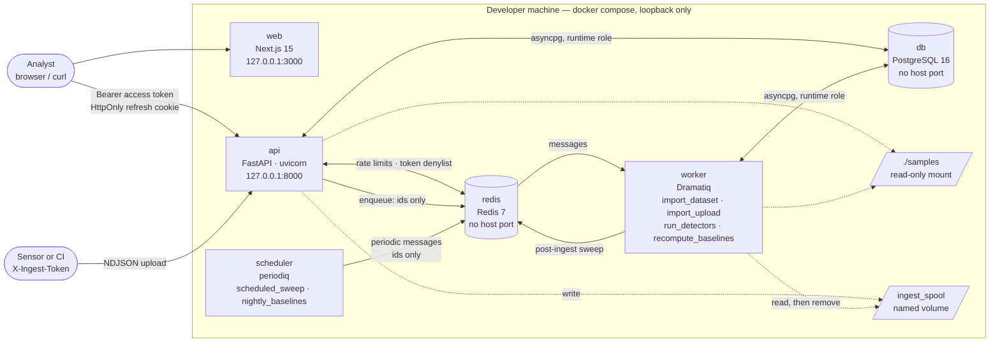
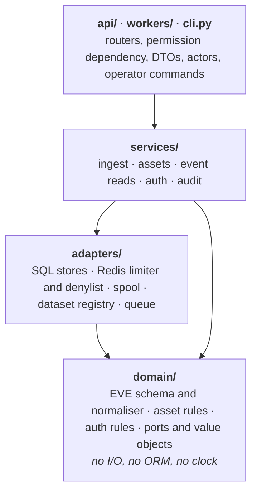
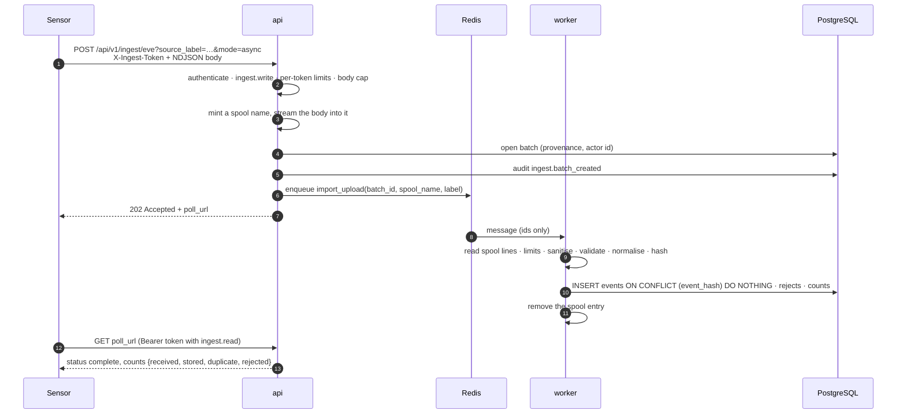

# AegisNet — Network Threat Detection Lab

[](https://github.com/pchrysostomou/aegisnet/actions/workflows/ci.yml)
[](https://github.com/pchrysostomou/aegisnet/actions/workflows/security.yml)
[](backend/pyproject.toml)
[](LICENSE)

A self-hosted, **defensive-only** platform for ingesting network security telemetry
(Suricata EVE JSON), detecting suspicious behaviour with deterministic heuristics,
correlating findings into incidents, and producing evidence-based investigation briefs for
human analysts. Everything runs on one machine with `docker compose`, binds to loopback,
and can be exercised end to end with the committed synthetic corpus.

> **Status: Milestones 1 and 2 complete (Chunks 1–13).** The stack
> builds and reaches healthy from a clean clone; the schema is created with least-privilege
> grants; users, roles, service tokens, rate limits and an append-only audit trail are in
> place; the HTTP API ingests telemetry, manages the asset inventory and serves bounded event
> reads. **All five detection rules run over stored events:** a `periodiq` scheduler sweeps
> every ten minutes and recomputes baselines nightly, every completed ingest batch queues its
> own sweep, alerts are stored under a dedup key and served by the API, and `make eval` writes
> the first per-detector metrics table from the labelled cases and the benign corpus. Those
> numbers come from synthetic data authored here. The isolated Suricata lab now exists too: an
> opt-in, internal-only network where a pinned Suricata watches traffic between two containers
> this project creates. It found two real defects on its first run, both since fixed
> ([ADR-022](docs/adr/ADR-022-event-time-and-dns-direction.md)), and **four of the five rules
> now fire on a committed capture of real sensor output**; the fifth abstains for want of a
> baseline. What that is and is not evidence of is written down in
> [`docs/evaluation.md`](docs/evaluation.md) §9. **There is no correlation, no AI brief and no
> analyst UI** — those are Milestones 3 to 5. [`docs/STATUS.md`](docs/STATUS.md) is the authoritative record of what exists and
> what has been verified, with the evidence for every claim below.

---

## Contents

- [Safety and scope boundary](#safety-and-scope-boundary)
- [What it does today](#what-it-does-today)
- [Architecture](#architecture)
- [Security model](#security-model)
- [Quickstart](#quickstart)
- [Development](#development)
- [Repository map](#repository-map)
- [Roadmap](#roadmap)
- [Documentation](#documentation)
- [Licence](#licence)

---

## Safety and scope boundary

AegisNet is a defensive, read-only analysis tool. These boundaries are structural, not
aspirational:

- **No offensive capability.** It does not scan, probe, exploit, enumerate, brute-force, or
  target any system. It contains no such tooling and never will.
- **No automated response.** It never blocks traffic, changes a firewall, disables an
  account, quarantines a host, or takes any other real-world action. The AI layer (Milestone
  5) may only *recommend* safe actions for a human to review and perform manually.
- **Local-only by default.** Every published port binds to `127.0.0.1`. The database and
  Redis publish no host ports at all.
- **Analyse only what you are authorised to analyse.** Use the project's own synthetic
  corpus, your own lab traffic, or telemetry from systems you administer.
- **The application stack never touches a network interface.** It reads files and serves an
  API. The one component that captures packets is the opt-in lab
  ([ADR-021](docs/adr/ADR-021-isolated-suricata-lab.md)): three containers on a network with
  `internal: true`, so Docker attaches no default route, watching traffic between containers
  the project itself creates. It starts only when you ask for it by name, it publishes no
  port, its sensor runs in IDS mode with one capability and cannot block anything, and
  `make lab-preflight` asks the running container to confirm it has no way out before you
  generate a packet.
- **Captures and live sensor output are never committed.** `.gitignore` treats `*.pcap`,
  `*.pcapng` and `eve*.json` as sensitive data rather than fixtures. A lab capture reaches
  the repository only after `tools/sanitize_eve.py` has stripped every content-bearing field
  and **refused** to write at all if one address or name outside documentation space survived.

---

## What it does today

| Capability | State |
|---|---|
| Six-service Compose stack (PostgreSQL 16, Redis 7, FastAPI api, Dramatiq worker, periodiq scheduler, Next.js web), hardened and loopback-only | ✅ Reaches healthy from a clean clone; CI proves it on every push |
| Schema for the nine Milestone 1 tables, applied by Alembic under a migrator role; the runtime role gets `SELECT/INSERT/UPDATE` only, `SELECT/INSERT` on `audit_log`, `DELETE` on one table | ✅ [ADR-012](docs/adr/ADR-012-migrations-in-package-and-role-grants.md), [ADR-015](docs/adr/ADR-015-asset-inventory-and-event-reads.md); proven by the database suite |
| Suricata EVE normalisation: parse limits, sanitiser, validated schema, canonical `event_hash`, promoted columns plus a JSONB payload | ✅ [ADR-013](docs/adr/ADR-013-event-hash-payload-and-event-type-triage.md); pure, clock-free, 100 % covered |
| Ingest: streaming NDJSON over HTTP (body or multipart, sync or async through a capped spool) or from a registered dataset; per-line rejects with reason codes; idempotent storage; provenance and counts per batch | ✅ [ADR-014](docs/adr/ADR-014-ingest-entrypoints-ports-and-worker-layer.md), [ADR-016](docs/adr/ADR-016-authentication-rbac-audit-and-rate-limits.md) |
| Asset inventory: validated specs, cross-asset CIDR overlap refusal, most-specific-prefix resolution, bulk create, soft delete, seed file | ✅ [ADR-015](docs/adr/ADR-015-asset-inventory-and-event-reads.md) |
| Event reads: windows of at most 30 days, keyset cursors, page size ≤ 200, filters by type, address, CIDR, port, flow, batch and asset; stats by type and hour; payloads only for roles allowed to see them | ✅ [ADR-015](docs/adr/ADR-015-asset-inventory-and-event-reads.md) |
| Authentication and authorisation: Argon2id users with lockout, 15-minute HS256 access tokens, rotating refresh cookies with reuse detection, hashed service tokens for sensors, deny-by-default permission on every route | ✅ [ADR-016](docs/adr/ADR-016-authentication-rbac-audit-and-rate-limits.md), [`SECURITY.md`](SECURITY.md) |
| Audit trail (append-only, bounded detail, admin read API) covering logins, denials, refused uploads and rejected import ids, and Redis rate limits that fail closed for login and ingest | ✅ [ADR-016](docs/adr/ADR-016-authentication-rbac-audit-and-rate-limits.md) |
| Operator CLI (`python -m aegisnet.cli`) for datasets, batches, assets, events, users and service tokens; `make` targets for every operator task | ✅ |
| Tests: 941 hermetic tests (unit, integration, security, detectors) at 94 % coverage, 51 database tests against a real PostgreSQL, a CI stack job that logs in, ingests over HTTP, watches the post-ingest sweep and reads the alerts | ✅ [`docs/STATUS.md`](docs/STATUS.md) |
| All five detection rules as pure, versioned functions over bounded windows with derived, bounded evidence and a recorded severity formula: D-001 port scan, D-002 auth-failure burst, D-003 DNS anomaly / tunnelling, D-004 periodic beaconing, D-005 outbound volume anomaly against per-asset baselines; 34 labelled positive and hard-negative cases pinned to their generator (`make test-detectors`) | ✅ Milestone 2, Chunks 8, 10 and 11 ([ADR-017](docs/adr/ADR-017-detector-interface-and-labelled-fixtures.md), [ADR-019](docs/adr/ADR-019-baselines-precomputed-and-address-keyed.md), [`docs/detection-rules.md`](docs/detection-rules.md)) |
| The baseline job: each asset's hourly outbound history summarised into `asset_baselines` (mean, stddev, p95, sampled hours) by `make recompute-baselines`, the `recompute_baselines` actor or an admin's `POST /detections/baselines/recompute`; D-005 abstains without a baseline | ✅ Milestone 2, Chunk 11 ([ADR-019](docs/adr/ADR-019-baselines-precomputed-and-address-keyed.md)) |
| The sweep: six detection tables, the registry synced from code, one load per interval sliced on each rule's grid, severity from the asset's criticality with a stored rationale, dedup by a UNIQUE key, per-rule failure isolation in `detector_runs`, the `run_detectors` actor, `make run-detectors`, and the read API for alerts, rules and runs plus the admin sweep trigger | ✅ Milestone 2, Chunk 9 ([ADR-018](docs/adr/ADR-018-detection-sweep-alert-storage-and-failure-isolation.md), [`docs/api-milestone-2.md`](docs/api-milestone-2.md)) |
| The schedule: a `periodiq` scheduler service sends `scheduled_sweep` every ten minutes (a one-hour lookback on a fixed grid, overlap absorbed by dedup) and `nightly_baselines` at 02:00; a completed ingest batch queues a sweep over its own event-time span, from the worker or inline after a sync upload (`POST_INGEST_SWEEP`) | ✅ Milestone 2, Chunk 12 ([ADR-020](docs/adr/ADR-020-schedule-post-ingest-sweep-and-evaluation-harness.md)) |
| `make eval`: every labelled case through its rule (T1) and every rule over the benign corpus (T2), written into [`docs/evaluation.md`](docs/evaluation.md) §8 and pinned by a test; strict verdicts, D-005 marked as abstaining without baselines | ✅ Milestone 2, Chunk 12 ([ADR-020](docs/adr/ADR-020-schedule-post-ingest-sweep-and-evaluation-harness.md)); synthetic data only, no claim about real traffic |
| The isolated Suricata lab: an opt-in, internal-only, IDS-only sensor watching traffic between two containers the project creates, a sanitiser that refuses to publish anything it cannot make safe, and one committed real capture that the ingest path stores end to end | ✅ Milestone 2, Chunk 13 ([ADR-021](docs/adr/ADR-021-isolated-suricata-lab.md), [`infra/lab/README.md`](infra/lab/README.md)) |
| Correlation: alerts about one entity within a sliding window become one incident, with a case number, a derived severity that escalates when three distinct rules agree, an ordered timeline and a workflow whose transitions are a table rather than an opinion | ✅ Milestone 3, Chunk 15 ([ADR-023](docs/adr/ADR-023-correlation-and-incidents.md)); a closed case is never extended, and a re-run adds nothing |
| Real sensor output reads correctly: a flow event is filed under the instant the conversation began, not when Suricata announced it, and a DNS record's direction comes from its own type rather than from the presence of a response code | ✅ Chunk 14 ([ADR-022](docs/adr/ADR-022-event-time-and-dns-direction.md)); the two defects the lab found, with four of five rules firing on the real capture afterwards — [`docs/evaluation.md`](docs/evaluation.md) §9 |
| Correlation and incidents, analyst dashboard, AI investigation briefs | ⬜ Milestones 3–5 ([roadmap](#roadmap)) |

---

## Architecture

A modular monolith with an out-of-process worker and a separate web app. Rationale and the
full component list are in [`ARCHITECTURE.md`](ARCHITECTURE.md); the diagrams below show
what is running today.

### Deployment topology



An admin's `POST /api/v1/detections/sweeps` queues `run_detectors(start, end)` the same way an
upload queues `import_upload`; the worker loads the interval once, runs every rule, writes alerts
under a UNIQUE dedup key and one `detector_runs` row per rule. Nobody has to ask, though: the
`scheduler` sends a sweep every ten minutes over the last hour and the baseline recompute
nightly, and a batch that completes queues a sweep over its own event-time span
([ADR-020](docs/adr/ADR-020-schedule-post-ingest-sweep-and-evaluation-harness.md)).

Every service runs as a non-root user with `cap_drop: ALL` and `no-new-privileges`. `db`,
`redis`, `worker` and `scheduler` publish no host port. The samples directory is the only place a
dataset can be imported from, and the spool is the only place an upload waits; both are
resolved by id, never by a path a client supplied.

### Backend layering



The layering is enforced in CI by import-linter: `domain/` imports nothing from the
infrastructure, and each layer may only depend on the ones below it. Services talk to
storage through the Protocols in `domain/ports.py`, so the whole HTTP surface runs in the
test suite against in-memory fakes with a settable clock.

### An upload, end to end



`mode=sync` runs the same pipeline inline for uploads of at most 1000 lines and answers
with the finished batch. Ingesting the same lines twice stores nothing the second time and
reports every line as a duplicate.

### Request handling


---

## Security model

Full detail, including the disclosure process, is in [`SECURITY.md`](SECURITY.md); the
threat catalogue with the test that verifies each mitigation is in
[`THREAT_MODEL.md`](THREAT_MODEL.md).

| Permission | viewer | analyst | admin | ingest_service |
|---|:-:|:-:|:-:|:-:|
| `meta.read` | ✓ | ✓ | ✓ | ✓ |
| `auth.self` · `assets.read` · `events.read` · `alerts.read` | ✓ | ✓ | ✓ | |
| `assets.write` · `events.payload` · `ingest.read` · `detections.read` | | ✓ | ✓ | |
| `assets.admin` · `ingest.import` · `audit.read` · `detections.run` | | | ✓ | |
| `ingest.write` | | | ✓ | ✓ |

- Every route declares its permission through one dependency; a security test enumerates
  the router and fails on any route without one. The only credential-free routes are the
  two health probes, login and refresh.
- Passwords are Argon2id; refresh and service tokens are stored only as SHA-256 digests;
  the signing secret must be at least 32 bytes; every secret is redacted from the logs.
- Login is limited per client address and per account and locks the account after five
  failures; ingest is limited per token by request count and by bytes; those limits refuse
  requests if Redis is unreachable, read limits let them through.
- Uploads are capped before a byte is parsed; every line is capped again in size, nesting
  and field count; control characters never reach a log line or a screen.
- The audit table accepts inserts only, enforced by PostgreSQL grants rather than by
  application code.

---

## Quickstart

Requirements: Docker with Compose v2, Python 3 on the host (for the bootstrap script),
`make`. For native backend development also [`uv`](https://docs.astral.sh/uv/); for the
frontend Node 22 with `corepack`.

```bash
git clone https://github.com/pchrysostomou/aegisnet.git
cd aegisnet

# 1. Generate a local .env containing random, development-only secrets.
#    Idempotent: never overwrites an existing .env without --force, never prints a secret.
make bootstrap

# 2. Build the images, start the stack, and wait until every service is healthy.
make up

# 3. Create the schema. Runs `alembic upgrade head` inside the api image as the migrator
#    role; the runtime role never holds DDL rights.
make migrate
make migrate-status                             # revision held by the database vs. the head this build expects

# 4. Seed the lab inventory (14 hosts, idempotent by hostname), then ingest the registered
#    synthetic corpus (2000 events). Run the ingest twice: the second run stores nothing
#    and reports every line as a duplicate.
make seed
make demo-ingest
make demo-ingest LABEL=second-run
make demo-ingest MODE=async LABEL=via-worker     # enqueues for the worker; prints the batch id
make batch ID=<uuid>                            # poll it

# 5. Create an admin and an ingest service token. The password is prompted without echo
#    (or piped in); the token is printed exactly once and stored as a hash.
make create-user EMAIL=admin@example.test ROLE=admin
make create-service-token NAME=sensor-1            # copy the "token" field

# 6. Use the API. Everything except login, refresh and the health probes needs a credential:
#    users log in for a 15-minute bearer plus a rotating HttpOnly refresh cookie, sensors
#    send X-Ingest-Token. Roles: viewer < analyst < admin; a service token can only ingest.
API=http://127.0.0.1:8000/api/v1
ACCESS=$(curl -s -X POST $API/auth/login -H 'content-type: application/json' \
    -d '{"email":"admin@example.test","password":"<the password>"}' \
    | python3 -c 'import json,sys; print(json.load(sys.stdin)["access_token"])')
curl -H "Authorization: Bearer $ACCESS" "$API/assets/resolve?ip=10.10.0.53"
curl -H "Authorization: Bearer $ACCESS" "$API/events?from=2026-09-01T00:00:00Z&to=2026-09-02T00:00:00Z&event_type=dns&limit=5"
curl -H "X-Ingest-Token: <token>" -H 'content-type: application/x-ndjson' \
    --data-binary @samples/synthetic/benign-baseline-01.ndjson \
    "$API/ingest/eve?source_label=sensor-1&mode=async"   # 202 with a poll_url; the worker finishes it
curl -H "Authorization: Bearer $ACCESS" "$API/audit?limit=5"        # admin only, newest first
curl -X POST -H "Authorization: Bearer $ACCESS" -H 'content-type: application/json' \
    -d '{"from":"2026-09-01T00:00:00Z","to":"2026-09-01T02:00:00Z"}' "$API/detections/sweeps"   # 202: the worker runs every rule
curl -H "Authorization: Bearer $ACCESS" "$API/detections/runs?limit=5"   # one row per rule: success / error / skipped
curl -H "Authorization: Bearer $ACCESS" "$API/alerts?limit=5"            # none from the benign corpus, by design

# The operator CLI covers the same ground without a token (JSON out).
docker compose run --rm api python -m aegisnet.cli resolve 10.10.0.53
docker compose run --rm api python -m aegisnet.cli assets -q resolver
docker compose run --rm api python -m aegisnet.cli events --from 2026-09-01T00:00:00Z \
    --to 2026-09-02T00:00:00Z --type dns --limit 5
docker compose run --rm api python -m aegisnet.cli service-tokens
make run-detectors FROM=2026-09-01T00:00:00Z TO=2026-09-01T02:00:00Z   # the same sweep, inline, one JSON line
make recompute-baselines WINDOW_DAYS=7                                   # per-asset outbound baselines for D-005
docker compose logs scheduler                                            # the two periodic actors and their cron lines

# 7. Probe it. Everything is bound to 127.0.0.1; the version route needs a credential too.
curl http://127.0.0.1:8000/healthz              # {"status":"ok"}
curl http://127.0.0.1:8000/readyz               # {"status":"ok"} once PostgreSQL and Redis answer
curl -H "X-Ingest-Token: <token>" $API/meta/version  # includes "schema_revision":"0004_incident_tables"
curl http://127.0.0.1:3000/api/health           # {"status":"ok"}
open http://127.0.0.1:8000/docs                 # OpenAPI UI (disabled when ENV=production)

# 8. Tear down, including the database volume.
make down
```

`make help` lists every target. Targets are added by the commit that introduces the thing
they operate on, so the Makefile never advertises a command that cannot work. The CI
`stack` job runs steps 1 to 3, creates a user and a token, ingests the corpus over HTTP
and reads the finished batch, on every push.

---

## Development

### Checks

```bash
make backend-install   # uv sync --frozen
make check             # verify-ignore + ruff (backend, tools) + import contracts + format + mypy + pytest
make test-cov          # the suite with a coverage report
make compose-test      # the same suite inside the hermetic test-runner container
make compose-config    # parse and interpolate every Compose manifest without starting anything
make test-db           # the database suite against an ephemeral PostgreSQL 16 (needs .env)
make test-detectors    # the detector suite alone: bounds, severity, every rule, every labelled fixture
make gen-fixtures      # regenerate the labelled fixtures after a case definition changes
make eval              # T1 + T2 metrics into docs/evaluation.md §8 (a test pins the block; run it after touching a rule)
make test-security     # the security-marked suite: compose policy, payload limits, RBAC, the lab
```

The lab is opt-in and separate; nothing below starts unless you ask for it by name.

```bash
make lab-preflight     # L-0/L-1: prove the network is internal and has no default route
make lab-capture       # one full run: sensor up, six traffic shapes, flush, export
make lab-sanitize      # L-5: strip and verify, into samples/lab/
make eval-lab          # T3: ingest the sanitised capture, sweep it, print what fired
make lab-clean         # remove the lab, its capture volume and the exported capture
```

The default suite is hermetic: no PostgreSQL, no Redis, no network. Readiness probes are
replaced with in-process fakes, the routes run against in-memory stores through the same
dependency wiring as production, and the security tests read the committed Compose files,
Dockerfiles, `.env.example`, `.gitignore` and pre-commit configuration **as data**. They
prove what the manifests declare; whether a running stack honours those declarations is
proven separately by `make up`, which the CI `stack` job also runs.

The database suite (`backend/tests/db/`, marker `db`) is opt-in and runs against a
throwaway PostgreSQL 16 started from `docker-compose.test.yml` with `--profile db`: it
applies every revision, runs Alembic's own `compare_metadata` to prove the ORM and the
migrated schema agree, asserts the runtime role's exact privilege matrix, exercises the SQL
stores, and downgrades to base to prove nothing is left behind. CI runs it as the
`migrations` job.

### Container topology

Six services: `db` (PostgreSQL 16), `redis` (Redis 7), `api` (FastAPI), `worker`
(Dramatiq: `import_dataset`, `import_upload`, `run_detectors`, `recompute_baselines` and the
two periodic actors), `scheduler` (periodiq, sends `scheduled_sweep` and `nightly_baselines`;
Redis only, no volume), `web` (Next.js placeholder).
`db`, `redis`, `worker` and `scheduler` publish no host port. `api` and `worker` mount `./samples`
read-only at `/app/samples`, the only place a dataset can be imported from, and share the
`ingest_spool` volume where uploads wait. `api` and `web` publish only on `127.0.0.1`, so
nothing is reachable from another host. Every service sets `cap_drop: ["ALL"]` and
`no-new-privileges:true`.

Every container runs as a non-root user. The project images set `USER` in their
Dockerfiles. The official `postgres` and `redis` images start as root and drop privileges
with `gosu`/`setpriv`, which needs `CAP_SETUID` and therefore fails under `cap_drop: ALL`;
they are started directly as `postgres` and `redis` via `user:` so no privilege switch is
ever attempted. `read_only` root filesystems and image digest pinning are tracked as later
work (Milestone 6 and decision F-5) and are **not** applied.

A seventh container exists but is not part of this stack: the lab's sensor
([ADR-021](docs/adr/ADR-021-isolated-suricata-lab.md)) lives in
`infra/lab/docker-compose.lab.yml`, on its own `internal: true` network, behind the `lab`
profile. It is the only place in the repository where a capability is added back after
`cap_drop: ALL` — `NET_RAW`, on the sensor alone, because no capability-less process can
open a packet socket — and a test pins that exception to that one service.

The worker's and the scheduler's healthchecks are process liveness only and make no readiness claim. Readiness
(`/readyz`) covers PostgreSQL and Redis reachability and nothing else; it names no
component in its response.

The database is initialised with two least-privilege roles by
[`infra/postgres/init/01_roles.sh`](infra/postgres/init/01_roles.sh): `aegisnet_migrator`
owns the schema, `aegisnet_app` is the runtime role and never receives DDL rights. The
script validates every interpolated role name and secret against a strict allowlist and
fails closed, and it creates no tables. The schema is created only by `make migrate`,
which runs the Alembic revisions shipped inside the package under the migrator role
([ADR-012](docs/adr/ADR-012-migrations-in-package-and-role-grants.md)).

### Secrets

`.env` is gitignored and additionally blocked by a pre-commit hook. `make bootstrap` replaces
every `__REPLACE_ME__` placeholder in [`.env.example`](.env.example) with
`secrets.token_urlsafe(48)` and writes the file with `0600` permissions where the platform
supports it. The application refuses to start while any secret still holds a placeholder,
unless `ENV=test`. These are **development-only** credentials for a local lab; production
secret management is out of scope. See
[ADR-011](docs/adr/ADR-011-bootstrap-env-secrets.md).

### Line endings

`.gitattributes` normalises every text file to LF on every platform. Several files are
mounted or copied straight into Linux containers — the PostgreSQL init script in
particular — and a CRLF checkout (the Git for Windows default) breaks them.

### Contributing

See [`CONTRIBUTING.md`](CONTRIBUTING.md) for the workflow, the checks a change must pass,
and how evidence is recorded. Security reports go through GitHub's private vulnerability
reporting, as described in [`SECURITY.md`](SECURITY.md).

---

## Repository map

```
.
├── backend/                 FastAPI application, Dramatiq worker, operator CLI, tests
│   ├── src/aegisnet/
│   │   ├── api/             routers, the permission dependency, DTOs, error envelope
│   │   ├── services/        ingest, assets, event reads, auth, audit, the sweep, baselines, schedule, evaluation
│   │   ├── adapters/        SQL stores (incl. alerts, rules, runs), migrations, Redis, spool, registry, queues, labelled cases
│   │   ├── domain/          EVE normaliser, asset and auth rules, ports — pure, no I/O
│   │   │   └── detectors/   window and result bounds, severity formula, baselines, the five rules, evaluation verdicts
│   │   ├── workers/         entrypoint shared by worker and scheduler, the actors, the two periodic actors
│   │   └── cli.py           python -m aegisnet.cli
│   └── tests/               unit · integration · security · detectors · db (opt-in, real PostgreSQL)
│       └── fixtures/labelled/  labelled detector cases, rendered by tools/gen_labelled_fixtures.py
├── frontend/                Next.js placeholder (health page and /api/health)
├── infra/                   PostgreSQL role init script, .env bootstrap
│   └── lab/                 the opt-in isolated Suricata lab: compose file, sensor config, target, generator
├── samples/                 committed synthetic corpus, one sanitised real lab capture, asset seeds, dataset registry
├── tools/                   the seeded synthetic EVE generator, the labelled-fixture generator, the capture sanitiser
├── docs/                    STATUS, PRD, data model, API contract, delivery plan, ADRs
├── docker-compose.yml       the six-service stack
├── docker-compose.test.yml  hermetic test runner and the ephemeral test database
└── Makefile                 every operator and developer task
```

---

## Roadmap

| Milestone | Scope | State |
|---|---|---|
| M1 | Foundation, ingest, normalisation, asset inventory, auth and audit | ✅ Complete; acceptance criteria and evidence in [`docs/delivery-plan.md`](docs/delivery-plan.md) and [`docs/STATUS.md`](docs/STATUS.md) |
| M2 | Five deterministic detectors (port scan, auth-failure burst, DNS anomaly, periodic beaconing, outbound volume anomaly) with labelled fixtures; the isolated Suricata lab | ✅ Complete (Chunks 8–13); every acceptance criterion in [`docs/delivery-plan.md`](docs/delivery-plan.md) is ticked with evidence. The lab's two findings are open defects with a chunk of their own, not unmet criteria |
| M3 | Correlation into incidents, timeline, analyst workflow | 🟡 Chunk 15 done: the grouping policy, the four incident tables, the workflow state machine and the correlation CLI; the API, the audited transitions and the demo scenario remain |
| M4 | Analyst dashboard (Next.js) | ⬜ |
| M5 | Investigation brief via Perplexity, with redaction canaries, and Markdown export | ⬜ |
| M6 | Hardening, evaluation with measured accuracy, documentation, release | ⬜ |

Detector accuracy is **unmeasured** and no claim is made until Milestone 6
([`docs/evaluation.md`](docs/evaluation.md)). The full plan with acceptance gates is in
[`docs/delivery-plan.md`](docs/delivery-plan.md).

---

## Documentation

| Document | Contents |
|---|---|
| [`docs/STATUS.md`](docs/STATUS.md) | What is built, what is not, and the evidence for every verification |
| [`ARCHITECTURE.md`](ARCHITECTURE.md) | Components, data flow, technology rationale |
| [`THREAT_MODEL.md`](THREAT_MODEL.md) | Threats, mitigations, the test that verifies each, residual risks |
| [`SECURITY.md`](SECURITY.md) | Credential model, RBAC matrix, audit actions, rate limits, disclosure |
| [`docs/api-milestone-1.md`](docs/api-milestone-1.md) | Milestone 1 API contract and acceptance criteria |
| [`docs/api-milestone-2.md`](docs/api-milestone-2.md) | Alerts, rules, runs, baselines, the sweep trigger and the post-ingest sweep |
| [`docs/data-model.md`](docs/data-model.md) | PostgreSQL schema design |
| [`docs/PRD.md`](docs/PRD.md) | Product requirements |
| [`docs/delivery-plan.md`](docs/delivery-plan.md) | Six-milestone plan |
| [`docs/evaluation.md`](docs/evaluation.md) | Detection evaluation methodology; §8 holds the `make eval` table (synthetic T1/T2, pinned by a test), §9 the first lab run and what it found |
| [`docs/detection-rules.md`](docs/detection-rules.md) | The rule contract and each detector's specification, guards and hard negatives |
| [`docs/adr/`](docs/adr) | Architecture decision records (ADR-009 … ADR-023) |
| [`infra/lab/README.md`](infra/lab/README.md) | The lab runbook: what is safe about it, how to run it, what each traffic shape is for |
| [`PLANNING.md`](PLANNING.md) | Index of the Milestone 0 planning package |
| [`backend/README.md`](backend/README.md) | What the backend package contains today |
| [`frontend/README.md`](frontend/README.md) | The web placeholder |
| [`samples/README.md`](samples/README.md) | Datasets, the registry, how a file gets imported |
| [`CONTRIBUTING.md`](CONTRIBUTING.md) | How to work on the repository |
| [`CHANGELOG.md`](CHANGELOG.md) | Notable changes |

---

## Licence

[MIT](LICENSE). Chosen deliberately rather than accepted from a repository template: the
project is a portfolio and learning artefact, and a permissive licence keeps it maximally
reusable. The licence covers this project's own code only — it does not extend to any public
dataset an operator chooses to fetch, and those carry their own citation and use obligations
recorded per ingest batch.
