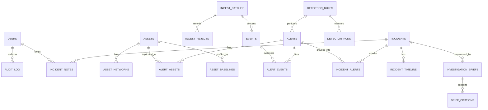

# AegisNet — PostgreSQL Data Model

Target: PostgreSQL 16. All migrations via Alembic. Status: **head is `0006_retention_role`.**
`0001_m1_baseline` (`ingest_batches`, `events`, `ingest_rejects`, `assets`, `asset_networks`,
`users`, `service_tokens`, `refresh_tokens`, `audit_log`), `0002_asset_network_delete_grant`,
`0003_detection_tables` (`detection_rules`, `detector_runs`, `alerts`, `alert_events`,
`alert_assets`, `asset_baselines`), `0004_incident_tables` (`incidents`, `incident_alerts`,
`incident_timeline`, `incident_notes`) and `0005_brief_tables` (`investigation_briefs`,
`brief_citations`) are implemented; anything below still described in the future tense is
planned.
Implementation notes that refine this document are in
[ADR-012](adr/ADR-012-migrations-in-package-and-role-grants.md): `audit_log` carries no foreign
keys, `service_tokens.created_by` is nullable, and hash columns carry a 32-byte length check.
Last updated: 2026-09-06

Conventions: `uuid` primary keys (`gen_random_uuid()`, pgcrypto), all times `timestamptz` in UTC,
`created_at`/`updated_at` on mutable tables, soft-delete only where noted, JSONB for open-ended structures with a
validated shape enforced at the application layer.

---

## Entity overview



---

## Core tables

### `ingest_batches`
Provenance for every ingest. Nothing enters `events` without a batch.

| Column | Type | Notes |
|---|---|---|
| `id` | uuid PK | |
| `source_type` | enum(`suricata_eve`) | Zeek reserved for future |
| `source_label` | text | e.g. `lab-run-2026-08-28`, `synthetic-portscan-01` |
| `dataset_id` | text NULL | FK-by-convention to `samples/registry.yml` |
| `dataset_licence` | text NULL | recorded so reports can print obligations |
| `dataset_citation` | text NULL | required citation string, if any |
| `ingest_method` | enum(`api_ndjson`,`api_file`,`registry_import`) | |
| `actor_user_id` | uuid NULL FK users | null for service tokens |
| `actor_token_id` | uuid NULL FK service_tokens | |
| `events_received` / `events_stored` / `events_duplicate` / `events_rejected` | int | |
| `status` | enum(`received`,`normalizing`,`complete`,`failed`) | |
| `started_at` / `finished_at` | timestamptz | |

### `events`
Normalized EVE records. Append-only in practice.

| Column | Type | Notes |
|---|---|---|
| `id` | uuid PK | |
| `batch_id` | uuid FK ingest_batches | `ON DELETE CASCADE` |
| `event_hash` | bytea (32) | sha256 over canonical EVE subset — **UNIQUE**, gives idempotent ingest |
| `event_time` | timestamptz NOT NULL | from EVE `timestamp`, except a **flow** record, which is filed under `flow.start`: its own timestamp is when Suricata emitted the record, not when the conversation happened (ADR-022). The emission time survives in `payload`. |
| `ingested_at` | timestamptz NOT NULL | server clock (see T-1.7) |
| `event_type` | enum(`alert`,`dns`,`http`,`flow`,`tls`,`fileinfo`,`anomaly`,`ssh`,`other`) | EVE `event_type` |
| `flow_id` | bigint NULL | EVE `flow_id`, correlates records of one flow |
| `src_ip` / `dest_ip` | inet NULL | |
| `src_port` / `dest_port` | int NULL | |
| `proto` | text NULL | `TCP`/`UDP`/`ICMP` |
| `app_proto` | text NULL | |
| `bytes_toserver` / `bytes_toclient` | bigint NULL | promoted from `flow` |
| `pkts_toserver` / `pkts_toclient` | bigint NULL | |
| `dns_query` | text NULL | promoted, control-chars stripped, length-capped |
| `dns_rrtype` | text NULL | |
| `dns_rcode` | text NULL | e.g. `NXDOMAIN` |
| `http_host` / `http_url_path` | text NULL | sanitized, capped |
| `sig_signature` / `sig_category` | text NULL | Suricata's own signature hit = evidence, not an AegisNet alert |
| `sig_signature_id` / `sig_severity` | int NULL | |
| `payload` | jsonb NOT NULL | validated remainder of the EVE record |

Field names follow the [Suricata EVE JSON format reference](https://docs.suricata.io/en/latest/output/eve/eve-json-format.html).

Indexes:
```
UNIQUE (event_hash)
BTREE  (event_time DESC)
BTREE  (src_ip, event_time DESC)
BTREE  (dest_ip, event_time DESC)
BTREE  (event_type, event_time DESC)
BTREE  (flow_id) WHERE flow_id IS NOT NULL
BTREE  (dest_port, event_time DESC) WHERE dest_port IS NOT NULL
GIN    (payload jsonb_path_ops)
```
Partitioning: **not** in v1 (volumes are lab-scale). `event_time` range partitioning is a noted v2 option.

### `ingest_rejects`
| Column | Type | Notes |
|---|---|---|
| `id` | uuid PK | |
| `batch_id` | uuid FK | |
| `line_number` | int | |
| `reason_code` | enum(`json_parse`,`schema_invalid`,`missing_required`,`timestamp_out_of_range`,`too_large`,`too_deep`,`unsupported_event_type`) | |
| `detail` | text | sanitized, capped at 512 chars |
| `raw_excerpt` | text NULL | first 256 chars, control-chars stripped — for debugging only, never sent externally |

### `assets` / `asset_networks`
| `assets` column | Type | Notes |
|---|---|---|
| `id` | uuid PK | |
| `hostname` | text UNIQUE NULL | |
| `environment` | enum(`lab`,`dev`,`staging`,`prod_sim`) | |
| `owner` | text NULL | team/person label |
| `criticality` | smallint CHECK 1..5 | feeds severity scoring |
| `tags` | text[] | GIN indexed |
| `description` | text NULL | |
| `is_active` | bool | soft-delete |

`asset_networks`: `id`, `asset_id` FK, `cidr` cidr NOT NULL, `is_primary` bool.
Index: `GIST (cidr inet_ops)` for fast containment lookup; unique on `(asset_id, cidr)`.
Resolution rule: most-specific matching CIDR wins; ties broken by `is_primary` then oldest asset.

### `asset_baselines`
Rolling statistics used by D-005 (and future detectors). Recomputed on a schedule, never inside detector logic.

`id`, `asset_id` FK, `metric` enum(`outbound_bytes_per_hour`,`distinct_dest_per_hour`,`dns_queries_per_hour`),
`window_days` int, `mean` double, `stddev` double, `p95` double, `sample_count` int, `computed_at` timestamptz.
Unique on `(asset_id, metric, window_days)`.

### `detection_rules`
Registry so alerts are reproducible against the exact rule version that fired.

`id` uuid, `rule_id` text UNIQUE (`D-001`…), `name`, `version` int, `enabled` bool,
`base_severity` smallint 1..5, `window_seconds` int, `params` jsonb (thresholds),
`description`, `mitre_hint` text NULL (informational only), `updated_at`.

### `detector_runs`
Observability + failure isolation (ARCHITECTURE §7).

`id`, `rule_id` FK, `window_start`, `window_end`, `events_examined` int,
`alerts_created` int, `status` enum(`success`,`error`,`skipped`), `error_detail` text NULL,
`duration_ms` int, `created_at`.

### `alerts`
| Column | Type | Notes |
|---|---|---|
| `id` | uuid PK | |
| `rule_id` | uuid FK detection_rules | |
| `rule_version` | int | snapshot at fire time |
| `dedup_key` | text | `rule_id:entity:window_bucket` — **UNIQUE**, prevents duplicate alerts on re-sweep |
| `severity` | smallint CHECK 1..5 | |
| `confidence` | numeric(3,2) CHECK 0..1 | |
| `severity_rationale` | jsonb | `{base, asset_criticality, signal_strength, formula, result}` — auditable |
| `entity_type` | enum(`asset`,`src_ip`,`dest_ip`,`domain`) | correlation key type |
| `entity_value` | text | |
| `first_seen` / `last_seen` | timestamptz | |
| `evidence` | jsonb NOT NULL | **derived & bounded** — counts, ports, intervals, sampled event ids |
| `event_count` | int | total contributing events (may exceed sampled ids) |
| `status` | enum(`open`,`correlated`,`suppressed`) | |
| `created_at` | timestamptz | |

Indexes: `UNIQUE (dedup_key)`, `(severity DESC, first_seen DESC)`, `(entity_type, entity_value, first_seen)`, `GIN (evidence)`.

`alert_events`: `alert_id`, `event_id`, `role` enum(`sample`,`peak`,`first`,`last`) — composite PK. Sampled, capped.
`alert_assets`: `alert_id`, `asset_id`, `role` enum(`source`,`destination`) — composite PK.

### `incidents`
| Column | Type | Notes |
|---|---|---|
| `id` | uuid PK | |
| `case_number` | text UNIQUE | human-friendly `AEG-2026-0001`, from a sequence |
| `title` | text | generated from rule mix + primary asset |
| `severity` | smallint 1..5 | max of members, with escalation bump |
| `status` | enum(`new`,`triaging`,`investigating`,`contained_recommended`,`closed_true_positive`,`closed_false_positive`,`closed_benign`) | |
| `primary_asset_id` | uuid FK assets NULL | |
| `correlation_key` | text | entity that grouped the alerts |
| `window_start` / `window_end` | timestamptz | |
| `distinct_rule_count` | int | drives escalation |
| `assigned_to` | uuid FK users NULL | |
| `closed_at` | timestamptz NULL | |
| `closure_reason` | text NULL | |
| `severity_rationale` | jsonb | the arithmetic that produced `severity`, so it can be re-derived rather than believed (ADR-023) |
| `created_at` / `updated_at` | timestamptz | |

Indexes: `(created_at DESC)`, `(status)`, and a partial `(correlation_key, window_end DESC)`
over open cases only — the lookup correlation makes on every run, and partial because a closed
case never absorbs a new alert. Check constraints: severity 1..5, `window_end >= window_start`,
`distinct_rule_count >= 1`, and a closed status carries `closed_at` exactly when it is closed.
`case_number` comes from the `incident_case_seq` sequence (ADR-023).

`incident_alerts`: `incident_id`, `alert_id` (composite PK), `added_at`, `added_by` enum(`correlation_engine`,`analyst`).
`alert_id` is additionally UNIQUE: an alert belongs to exactly one case, which is what makes a
correlation re-run a no-op rather than a second opinion (ADR-023).

### `incident_timeline`
Ordered, typed narrative. Append-only.

`id`, `incident_id` FK, `occurred_at` timestamptz, `entry_type` enum(`alert_fired`,`observation`,`status_change`,`note_added`,`brief_generated`,`report_exported`,`asset_linked`),
`summary` text, `detail` jsonb, `actor_user_id` uuid NULL, `alert_id` uuid NULL, `created_at`.
Index: `(incident_id, occurred_at)`. UNIQUE `(incident_id, entry_type, alert_id)`: a case says
the same thing about an alert once, however often correlation runs. PostgreSQL counts NULLs as
distinct in a UNIQUE, so the constraint only ever suppresses a repeat *about the same alert*: a
case takes as many `status_change` and `note_added` lines as an analyst produces, and correlation
still writes each `alert_fired` once. Correlation inserts `ON CONFLICT DO NOTHING`; a human's
action is inserted plainly, because doing the same thing twice is two things worth recording
(ADR-024). Reads are ordered `(occurred_at, id)`, which is what the keyset cursor carries.

### `incident_notes`
`id`, `incident_id`, `author_id`, `body` text (markdown, rendered via SafeMarkdown), `created_at`. No edits in v1.
CHECK `length(body) BETWEEN 1 AND 8000`, said again in `domain/incidents.clean_note_body` so an
over-long note is refused by field name rather than as an integrity error. Index
`(incident_id, created_at)`; reads are newest first. This is the **only** place a note's text is
stored: the timeline records that a note exists and how long it is, and the audit log the same
(ADR-024).

### `investigation_briefs`
Implemented by revision `0005_brief_tables` (Chunk 23). **Append-only**: the runtime role holds
`SELECT` and `INSERT` and nothing else — no `UPDATE`, no `DELETE` — the same grant `audit_log`
has and for the same reason. A brief records what a model said at a moment next to exactly what
was asked; one that can be edited afterwards is evidence of nothing (ADR-031).

Regenerating writes the next version rather than replacing one. A *failed* attempt is stored
too, so "the API was down at 03:10" is a row rather than a gap.

| Column | Type | Notes |
|---|---|---|
| `id` | uuid PK | |
| `incident_id` | uuid FK → `incidents` ON DELETE CASCADE | |
| `version` | int | UNIQUE with `incident_id`; allocated in the writing transaction, so a race loses rather than overwrites |
| `status` | enum(`complete`,`failed`) | schema and safety rejections are `failed` with a reason |
| `source` | enum(`perplexity`,`offline_fixture`) | the fixture is the committed sample served when the feature is off; never presented as a model's words |
| `packet_hash` | text (sha256 hex) | exactly what was sent, content-addressed — the cache key and the egress record |
| `packet_truncated` | bool | explicit truncation disclosure |
| `model` | text NULL | null unless a model actually answered |
| `summary` | text NULL | |
| `limitations` | text NULL | what the packet did not say |
| `claims` | jsonb | `[{text, kind: observed\|external, citations: [int], verified: bool}]` |
| `recommendations` | jsonb | `[{action, detail}]`, `action` from the nine-verb vocabulary in `domain/briefs/safety.py` |
| `has_unverified` | bool | any external claim that cited nothing; rendered `UNVERIFIED`, never dropped |
| `failure_reason` | text NULL | short and machine-readable — see `docs/api-milestone-5.md` |
| `prompt_tokens` / `completion_tokens` | int NULL | what the call cost |
| `requested_by` | uuid FK → `users` ON DELETE SET NULL | |
| `created_at` | timestamptz | |

Constraints: `UNIQUE (incident_id, version)`; `version >= 1`;
`(status = 'complete') = (summary IS NOT NULL)`; `(status = 'failed') = (failure_reason IS NOT NULL)`.
The last two are what stop a complete brief with nothing to say, or a failed one with no reason,
from being storable at all. Index: `(incident_id, version DESC)`.

The packet itself is stored nowhere — only its hash. It is reconstructible from the case, and
keeping a copy would mean keeping a second, unredacted-looking record of the same evidence.

### `brief_citations`
The sources a brief pointed at, one row each. Append-only on the same grant.

| Column | Type | Notes |
|---|---|---|
| `id` | uuid PK | |
| `brief_id` | uuid FK → `investigation_briefs` ON DELETE CASCADE | |
| `citation_id` | int | the number a claim refers to it by; UNIQUE with `brief_id` |
| `url` | text | |
| `title` | text | |
| `created_at` | timestamptz | |

Constraint: `url LIKE 'https://%'`. The domain refuses a non-https citation first; the database
says it again, because a citation is a link somebody will click.

The "citations or `UNVERIFIED`" rule lives on the claim rather than here: an external claim that
cited nothing is kept with `verified: false` and shown marked (ADR-030), which is more useful to
an analyst than a claim that quietly disappeared.

---

## Security & access tables

### `users`
`id`, `email` citext UNIQUE, `display_name`, `password_hash` text (Argon2id), `role` enum(`admin`,`analyst`,`viewer`),
`is_active` bool, `failed_login_count` int, `locked_until` timestamptz NULL, `last_login_at`, `created_at`.

### `service_tokens`
`id`, `name`, `token_hash` bytea (sha256 of a high-entropy token; plaintext shown once at creation),
`role` enum(`ingest_service`), `created_by` FK users, `expires_at`, `revoked_at` NULL, `last_used_at`.

### `refresh_tokens`
`id`, `user_id`, `token_hash`, `issued_at`, `expires_at`, `rotated_to` uuid NULL, `revoked_at` NULL,
`user_agent_hash`, `ip_hash`. Reuse of a rotated token revokes the whole chain.

### `audit_log`
Append-only. The app DB role receives `INSERT`/`SELECT` only — **no `UPDATE`, no `DELETE`** (T-2.5, T-5.3).

`id` bigserial, `occurred_at` timestamptz, `actor_user_id` NULL, `actor_token_id` NULL, `actor_ip` inet NULL,
`action` text — the list here is illustrative of the column's shape, not a contract: the actions actually
written are in [`SECURITY.md`](../SECURITY.md), and `brief.requested` and `brief.egress` were never implemented
(Chunk 22 wrote `brief.generated` instead, Chunk 24 `report.exported`). `target_type` text, `target_id` text NULL,
`result` enum(`success`,`denied`,`error`), `detail` jsonb (non-sensitive only), `correlation_id` uuid.
Indexes: `(occurred_at DESC)`, `(actor_user_id, occurred_at DESC)`, `(action, occurred_at DESC)`.

### `rate_limit_events` (optional, Redis is primary)
Persisted only for audit of repeated abuse: `id`, `subject_type`, `subject_id`, `endpoint`, `occurred_at`, `limit_name`.

---

## Retention

Implemented in Chunk 25 ([ADR-033](adr/ADR-033-deletion-is-a-different-principal.md)) and **off
by default**: `RETENTION_ENABLED` is false, because this is the only thing the project does that
cannot be undone.

| Table | Period | Column |
|---|---|---|
| `events` | 90 days | `event_time` — **except any event an alert still points at**, kept regardless |
| `ingest_rejects` | 30 days | `created_at` |
| `detector_runs` | 30 days | `created_at` |
| `audit_log` | 365 days (never below 30) | `occurred_at` |

Everything else is kept indefinitely, and the list is written out in `domain/retention.py`
rather than implied: a table in neither list is a table nobody decided about, and a unit test
fails on one.

**Deletion is a different principal.** `aegisnet_retention` is a third role holding
`SELECT, DELETE` on exactly those four tables, plus `SELECT` on `alert_events` so the evidence
exclusion can be expressed. It cannot `INSERT` and cannot `UPDATE` anything, anywhere — which is
what lets `audit_log` and the brief tables stay append-only *for the application* while still
having a bound. The run's own record is written by the app role, which cannot delete, so putting
a deletion into this database without a trace would take two credentials.

`events.event_time` is the sensor's clock, not the ingest clock: a batch imported today carrying
week-old traffic is already a week into its ninety days.
