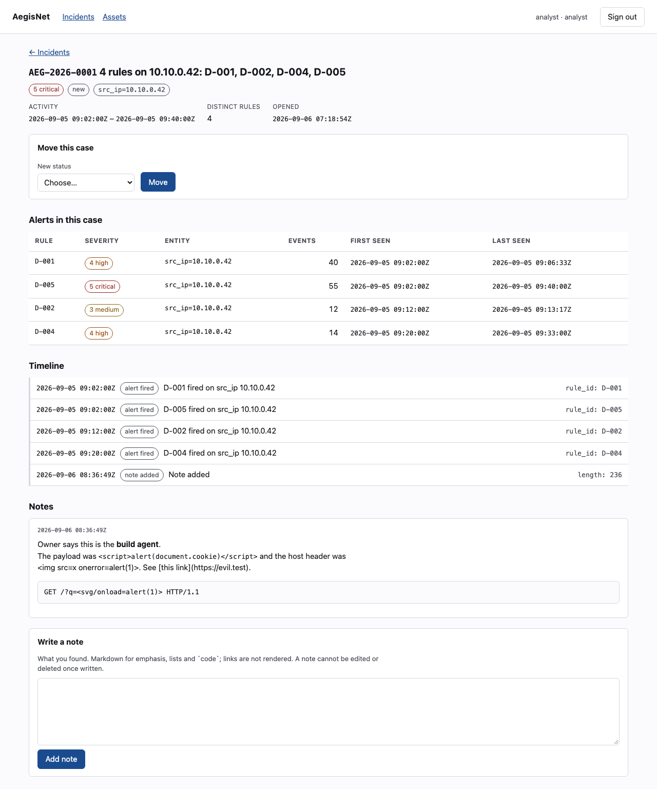

# AegisNet in two minutes

The README is the reference; this is the short version, for somebody deciding whether the
reference is worth their time.



## What it is

A defensive network threat-detection lab that runs on one machine with `docker compose`. It
reads Suricata EVE logs, runs five deterministic detectors over bounded windows — port scan,
authentication-failure burst, DNS anomaly, periodic beaconing, and outbound volume against a
per-asset baseline — groups the alerts about one host into an incident, and gives an analyst a
dashboard to work the case in. The case exports as a Markdown document that is byte-identical
every time it is rendered.

It does not scan, probe, block or respond to anything, and it never will. Every published port
binds to loopback.

## What is worth looking at

- **Every conclusion is explainable.** A detector is a pure, versioned function; an alert
  stores the evidence it was derived from and the arithmetic behind its severity. There is no
  model in the detection path.
- **The security model is tested rather than described.** `THREAT_MODEL.md` maps each of its
  thirty-six threats to the tests that hold the mitigation up, and a checker in the suite fails
  when a test is renamed, a row is deleted or a status claims more than its evidence.
- **Least privilege is in the grants.** The runtime database role cannot run DDL, cannot edit
  the audit log or a stored brief, and cannot delete what the retention policy deletes — that
  is a third role which can delete and cannot write.
- **The AI part is a witness, not an authority.** The optional investigation brief receives
  derived numbers and opaque tokens, never addresses or log text; what comes back can recommend
  only from a fixed list of things a person does, and has no field through which it could
  change a severity or a status. It is off by default and **no call has ever been made from
  this repository** — the brief in the screenshot is a committed offline sample.
- **Thirty ADRs**, each written when the decision was made, several of them recording a
  decision that was later found to be wrong and what replaced it.

## What it does not claim

Detector accuracy on real traffic is unmeasured. `docs/evaluation.md` §8 reports what the rules
do on data this repository generated; §9 reports what a real sensor's output broke the first
time it met them, and that four of the five rules now fire on a committed lab capture. The
fifth, the volume rule, has never judged real traffic at all
([#12](https://github.com/pchrysostomou/aegisnet/issues/12)). This is a portfolio and learning
project, and it says so wherever a number appears.

## Try it

```bash
git clone https://github.com/pchrysostomou/aegisnet.git && cd aegisnet
make bootstrap && make up && make migrate
make demo-scenario        # twelve seconds: one escalated case of four rules, and a bystander
make create-user EMAIL=admin@example.test ROLE=admin     # prompts for a password, without echo
```

Then sign in at <http://127.0.0.1:3000>. [`demo-script.md`](demo-script.md) walks the same three
minutes with measured timings, and [`STATUS.md`](STATUS.md) carries the evidence for every
claim above.
